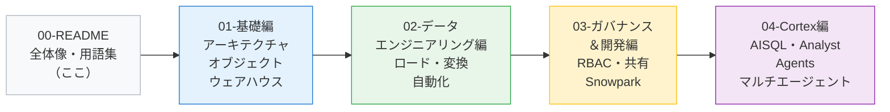
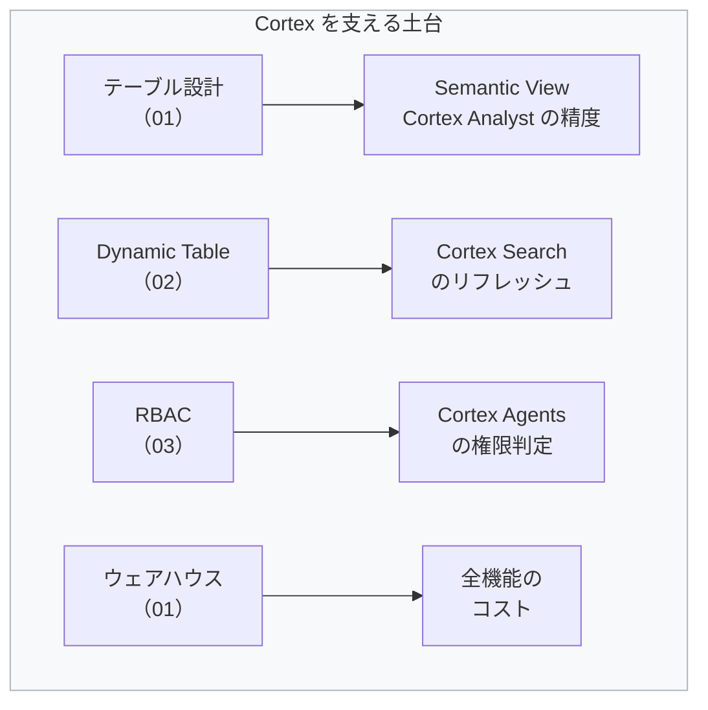

# Snowflake 実務学習ドキュメントセット

> 作成日: 2026-08-04 ／ 出典: Snowflake 公式ドキュメント（docs.snowflake.com）・Snowflake 公式ブログ
> 想定読者: Snowflake をこれから実務で使うエンジニア。SQL は書けるが Snowflake は初めて、という状態を出発点にしています。

---

## このドキュメントセットの構成



| ファイル | 内容 | 想定所要 | こんなときに読む |
|---|---|---|---|
| **00-README.md**（本書） | 全体像・用語集・学習順序 | 30分 | 最初に一度 |
| **01-snowflake-basics.md** | アーキテクチャ、オブジェクト階層、ウェアハウス、テーブル種別、Time Travel、クローン | 6時間 | Snowflake を触り始めるとき |
| **02-snowflake-data-engineering.md** | ステージ、COPY、Snowpipe、Stream、Task、Dynamic Table、性能・コスト最適化 | 8時間 | データを入れる・変換する担当になったとき |
| **03-snowflake-governance-dev.md** | RBAC、マスキング、行アクセス、データ共有、Snowpark、Streamlit、Git 連携 | 6時間 | 権限設計・アプリ開発をするとき |
| **04-snowflake-cortex.md** | AISQL、Cortex Search、Cortex Analyst、Cortex Agents、マルチエージェント | 12時間 | AI 活用を担当するとき |

---

## 学習順序の考え方

**Cortex から入りたくなりますが、遠回りに見えて 01〜03 を先に通す方が結果的に速いです。** 理由は次のとおりです。

- Cortex Analyst の精度は **Semantic View（＝テーブル設計とビジネス定義）** で決まる。テーブル設計を理解していないと精度改善のしようがない
- Cortex Search のリフレッシュは **Dynamic Table と同じ増分更新の仕組み**に従う。02 を知らないと「なぜサービス作成に失敗するのか」が分からない
- Cortex Agents のツールは**呼び出しユーザーのロール**で権限判定される。03 の RBAC を知らないと「なぜこの人だけ答えが返らないのか」が分からない
- コストの大半は**ウェアハウス**が占める。01 を知らないとコスト設計ができない



### 最短ルート（案件開始が迫っている場合）

| 優先 | 読む箇所 |
|---|---|
| 1 | 01 の 1〜4 章（アーキテクチャ・オブジェクト階層・ウェアハウス・テーブル種別） |
| 2 | 03 の RBAC 章 |
| 3 | 04 の全章 |
| 4 | 02（担当領域が下流なら後回しでよい） |

---

## Snowflake 用語 早見表

初学者がつまずきやすい用語を、**「他のシステムでいうと何か」**とセットで整理します。

### プラットフォーム基本

| 用語 | 意味 | 他システムでいうと |
|---|---|---|
| **アカウント** | Snowflake の契約単位。URL・ユーザー・オブジェクトの最上位の入れ物 | AWS アカウント / Azure サブスクリプション |
| **リージョン** | アカウントが物理的に置かれるクラウド上の場所 | AWS リージョン |
| **エディション** | Standard / Enterprise / Business Critical など機能レベル | ライセンスプラン |
| **クレジット** | 計算リソース使用量の単位。1 クレジット ＝ 1 ノード 1 時間相当 | 従量課金の単位 |
| **ウェアハウス（仮想ウェアハウス）** | クエリを実行する計算リソース。データの置き場所ではない | EC2 のような計算クラスタ |
| **Snowsight** | Snowflake の Web UI | 管理コンソール |

> ⚠️ **最大の用語トラップ**: Snowflake の「ウェアハウス」は**データウェアハウス（データの置き場所）ではありません**。**計算エンジン**です。データはウェアハウスとは完全に別のストレージ層にあります。ここを取り違えると設計が全部ずれます。

### オブジェクト

| 用語 | 意味 | 他システムでいうと |
|---|---|---|
| **データベース / スキーマ** | オブジェクトの階層的な入れ物 | RDBMS と同じ |
| **テーブル** | データの実体。Permanent / Transient / Temporary の 3 種類 | RDBMS と同じ |
| **ビュー / セキュアビュー** | クエリに名前を付けたもの。セキュアビューは定義と実行計画を隠す | RDBMS のビュー |
| **ステージ** | ファイルの置き場所。内部ステージ（Snowflake 管理）と外部ステージ（S3/Blob 等）がある | S3 バケットのマウントポイント |
| **ステージング（Stage）** | 上記のステージにファイルを置く行為 | — |
| **ストアドプロシージャ / UDF** | 手続き / 関数 | RDBMS と同じ |
| **マイクロパーティション** | Snowflake が自動で作る内部的なデータ分割単位（50〜500MB 非圧縮） | Parquet のファイル分割に近い |

### 権限

| 用語 | 意味 |
|---|---|
| **ロール** | 権限の束。ユーザーではなくロールに権限を付け、ユーザーにロールを付与する |
| **ACCOUNTADMIN** | 最上位ロール。日常作業で使ってはいけない |
| **SYSADMIN / SECURITYADMIN / USERADMIN** | それぞれオブジェクト作成 / 権限管理 / ユーザー管理を担当するシステムロール |
| **オーナーズライツ / コーラーズライツ** | ビューやプロシージャを「所有者の権限で実行する」か「呼び出した人の権限で実行する」か |

### データパイプライン

| 用語 | 意味 |
|---|---|
| **COPY INTO** | ステージ上のファイルをテーブルに一括ロードするコマンド |
| **Snowpipe** | ファイル到着を検知して自動ロードするサーバーレス機能 |
| **Stream** | テーブルの変更差分（CDC）を追跡するオブジェクト |
| **Task** | スケジュール実行またはイベント駆動で SQL を実行するオブジェクト |
| **Dynamic Table** | 「この SELECT の結果をこの鮮度で保ってほしい」と宣言するだけで、差分更新を自動で行うテーブル |
| **Time Travel** | 過去の時点のデータを参照・復元できる機能 |
| **ゼロコピークローン** | データを物理コピーせずにテーブル/スキーマ/DB を複製する機能 |

### AI（Cortex）

| 用語 | 意味 |
|---|---|
| **Cortex** | Snowflake の AI 機能群の総称。単一の機能名ではない |
| **AISQL** | SQL 関数として LLM 推論を呼ぶ機能（`AI_COMPLETE` 等） |
| **Cortex Search** | 非構造データ向けのマネージド検索サービス（RAG の検索側） |
| **Cortex Analyst** | 自然言語から SQL を生成する機能 |
| **Semantic View** | 「売上とは何か」などのビジネス定義を持つオブジェクト。Analyst の精度を決める |
| **Cortex Agents** | ツールを選んで実行するエージェント基盤 |
| **Snowflake Intelligence** | 上記をノーコードで使えるチャット UI |

---

## 環境準備（全編共通）

### トライアルアカウント

1. https://signup.snowflake.com/ からサインアップ（クレジットカード不要、30日間 $400 相当のクレジット）
2. クラウド（AWS / Azure / GCP）とリージョンを選ぶ
   - **Cortex を学ぶなら AWS ap-northeast-1（東京）または AWS us-west-2 が無難**（Cortex 系機能のリージョン制約が緩い）
3. Snowsight（Web UI）にログイン

### 学習用の共通セットアップ

以降のドキュメントで使う共通環境です。最初に一度だけ実行してください。

```sql
USE ROLE ACCOUNTADMIN;

-- 学習用のロール
CREATE ROLE IF NOT EXISTS lab_role;
GRANT ROLE lab_role TO USER IDENTIFIER(CURRENT_USER());

-- 学習用のウェアハウス（最小サイズ・60秒で自動停止）
CREATE WAREHOUSE IF NOT EXISTS lab_wh
  WAREHOUSE_SIZE = 'X-SMALL'
  AUTO_SUSPEND   = 60
  AUTO_RESUME    = TRUE
  INITIALLY_SUSPENDED = TRUE;

-- 学習用のデータベースとスキーマ
CREATE DATABASE IF NOT EXISTS lab_db;
CREATE SCHEMA   IF NOT EXISTS lab_db.core;

-- 権限付与
GRANT USAGE ON WAREHOUSE lab_wh   TO ROLE lab_role;
GRANT USAGE ON DATABASE  lab_db   TO ROLE lab_role;
GRANT ALL   ON SCHEMA    lab_db.core TO ROLE lab_role;

-- 以降はこのコンテキストで作業する
USE ROLE lab_role;
USE WAREHOUSE lab_wh;
USE DATABASE lab_db;
USE SCHEMA core;
```

> 💡 **`AUTO_SUSPEND = 60` は学習中の必須設定です。** ウェアハウスは動いている間ずっとクレジットを消費します。放置すると 1 日でトライアルクレジットを溶かします。

### 動作確認

```sql
SELECT CURRENT_ACCOUNT(), CURRENT_REGION(), CURRENT_ROLE(),
       CURRENT_WAREHOUSE(), CURRENT_DATABASE(), CURRENT_SCHEMA();
```

6 つとも値が返れば準備完了です。`CURRENT_WAREHOUSE()` が NULL の場合は `USE WAREHOUSE lab_wh;` を実行してください。

---

## トライアルクレジットを溶かさないための 5 か条

1. ウェアハウスは **X-SMALL** で始める。遅いと感じてから上げる
2. `AUTO_SUSPEND` は **60 秒**にする（既定値は 600 秒＝10分）
3. 大きなサンプルデータ（`SNOWFLAKE_SAMPLE_DATA` の SF100 以上）に `SELECT *` を投げない
4. Cortex Search サービスは**使い終わったら DROP する**（クエリが 0 でもサービング費用が発生する）
5. 1 日の終わりに `SHOW WAREHOUSES;` で稼働中のものがないか確認する

```sql
-- 今日の消費クレジットを確認する習慣をつける
SELECT DATE_TRUNC('day', start_time) AS d,
       service_type,
       ROUND(SUM(credits_used), 3) AS credits
FROM SNOWFLAKE.ACCOUNT_USAGE.METERING_HISTORY
WHERE start_time >= DATEADD('day', -7, CURRENT_TIMESTAMP())
GROUP BY 1, 2
ORDER BY 1 DESC, 3 DESC;
```

> ℹ️ `ACCOUNT_USAGE` のビューは反映に最大 3 時間ほどの遅延があります。即時に見たい場合は Snowsight の **Admin » Cost Management** を使ってください。

---

## 各ドキュメントの読み方（共通ルール）

本セットでは以下の記号を使います。

| 記号 | 意味 |
|---|---|
| 📘 **用語** | 初出の専門用語の説明 |
| 💡 **なぜ？** | 仕様の背景・設計思想の説明 |
| ⚠️ **つまずきポイント** | 初学者が高確率で踏む罠 |
| ❓ **よくある疑問** | 実際によく聞かれる質問と回答 |
| ✅ **手を動かす** | 実行して確認するチェックリスト |
| 🏢 **実務メモ** | 案件で判断を求められる論点 |

---

## 参考リンク

| 用途 | URL |
|---|---|
| 公式ドキュメント（日本語版あり） | https://docs.snowflake.com/ja/ |
| 公式チュートリアル | https://docs.snowflake.com/en/tutorials |
| Quickstarts（ハンズオン集） | https://quickstarts.snowflake.com/ |
| 認定資格（SnowPro Core） | https://learn.snowflake.com/ |
| コミュニティ | https://community.snowflake.com/ |
