# 01 Snowflake 基礎編

> **この巻で分かること**
> - Snowflake の 3 層アーキテクチャが、なぜ「速くて安い」を実現できるのか
> - オブジェクトの階層構造と、名前解決のルール
> - ウェアハウスのサイズ・課金・チューニングの考え方
> - テーブルの 3 種類と、選択を誤ったときのコスト影響
> - Time Travel とゼロコピークローンという Snowflake 独自機能の使いどころ
>
> **前提知識**: 基本的な SQL（SELECT / JOIN / GROUP BY）が書けること。それ以外は不要です。

---

## 1. Snowflake とは何か

### 1.1 一言でいうと

**クラウド上で動く、フルマネージドのデータプラットフォーム**です。SaaS として提供されるため、サーバーの構築・パッチ適用・チューニング・バックアップといった運用作業がほぼ発生しません。

📘 **用語: フルマネージド**
インフラの管理をベンダー側が全部やってくれる形態のこと。利用者は「何をしたいか」だけを SQL で書きます。インデックスの設計もパーティションの設計も、原則として不要です。

### 1.2 従来のデータベースと何が違うのか

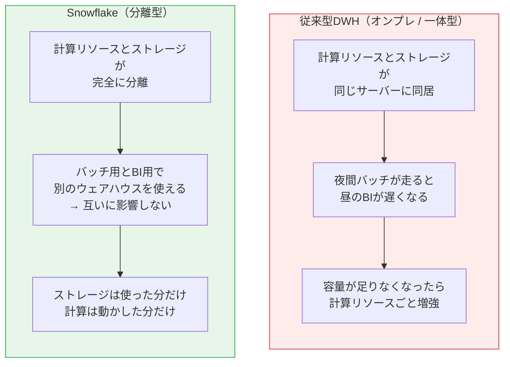

💡 **なぜ？ ─ 「分離」が生む 3 つの利点**

1. **ワークロードの独立**: 同じデータに対して、経理チーム用・BI 用・データサイエンス用に別々の計算リソースを割り当てられる。片方が重くてももう片方は影響を受けない
2. **弾力性**: 重い処理のときだけ大きな計算リソースを使い、終わったら止める。止めている間は計算費用ゼロ
3. **単一のデータコピー**: データを複製せずに全チームが同じ実体を見る。「営業部のExcelと経理部の数字が違う」問題が構造的に起きにくい

### 1.3 3 層アーキテクチャ

Snowflake は内部的に 3 つの層で構成されています。**この図はいつでも思い出せるようにしておいてください。トラブルシュートの起点になります。**

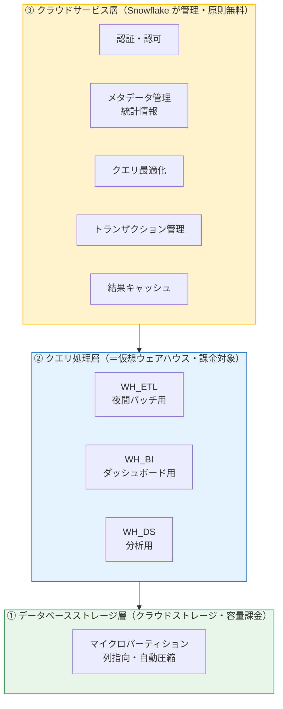

| 層 | 役割 | 課金 | 利用者が意識すること |
|---|---|---|---|
| ③ クラウドサービス層 | 認証、メタデータ、クエリ最適化、結果キャッシュ | 原則無料（コンピュート消費の10%を超えた分のみ課金） | ほぼ意識不要 |
| ② クエリ処理層 | SQL の実処理 | **クレジット（最大の費用）** | サイズ・稼働時間・分割 |
| ① ストレージ層 | データの永続化 | TB/月 | データ量・Time Travel 期間 |

⚠️ **つまずきポイント**
「テーブルを作ったのにデータが見えない」「クエリが `No active warehouse selected` で落ちる」——これは**②の層が動いていない**だけです。データ（①）は存在しています。`USE WAREHOUSE <name>;` を実行してください。

❓ **よくある疑問: メタデータだけの操作にウェアハウスは要る？**
不要です。`SHOW TABLES`、`DESCRIBE TABLE`、`SELECT COUNT(*) FROM t`（統計情報から返せる場合）などは③の層だけで完結し、ウェアハウスを起動しません。だから一瞬で返るしタダです。

---

## 2. データはどう格納されているか — マイクロパーティション

### 2.1 概要

Snowflake はテーブルのデータを **マイクロパーティション** という単位に自動分割して保存します。

📘 **用語: マイクロパーティション**
非圧縮で 50〜500MB 程度のデータのかたまり。列指向（カラムナ）で保存され、自動的に圧縮されます。**利用者が作るものではなく、Snowflake が挿入順に自動で作ります。**

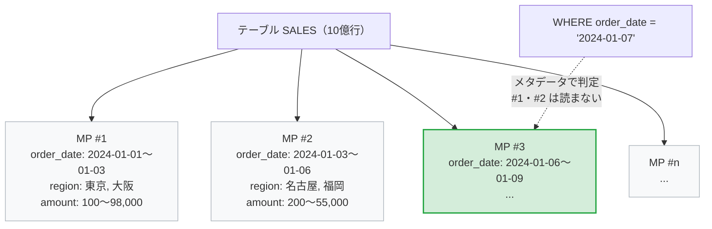

💡 **なぜ速いのか ─ プルーニング**
各マイクロパーティションについて、Snowflake は「この塊に入っている各列の最小値・最大値・NULL 数」などのメタデータを持っています。クエリの `WHERE` 句と照合し、**明らかに該当しない塊は読まずにスキップ**します。これを**プルーニング（枝刈り）**と呼びます。インデックスを張らなくても速いのはこの仕組みのおかげです。

### 2.2 実務上の意味

| 事実 | 実務での意味 |
|---|---|
| 列指向で保存される | `SELECT *` は無駄が大きい。必要な列だけ書くと読み取り量が激減する |
| メタデータでプルーニングされる | `WHERE` に絞り込みの効く列（日付など）を入れると劇的に速くなる |
| 挿入順に作られる | ランダムな順序でロードすると、どの塊にも全期間のデータが混ざりプルーニングが効かなくなる |
| 利用者は直接操作できない | インデックス設計は不要。ただし**クラスタリングキー**で並び順をヒントとして与えることはできる（→ 02 巻） |

⚠️ **つまずきポイント: `SELECT *` の代償**
1000 列のテーブルから 3 列だけ必要なのに `SELECT *` を書くと、読み取りデータ量が理論上 300 倍以上になります。列指向データベースでは `SELECT *` は「してはいけないこと」の筆頭です。

✅ **手を動かす**

```sql
USE WAREHOUSE lab_wh;

-- サンプルデータで読み取り量の差を体感する
-- ① 全列
SELECT * FROM SNOWFLAKE_SAMPLE_DATA.TPCH_SF1.LINEITEM LIMIT 100;

-- ② 2列だけ
SELECT l_orderkey, l_extendedprice FROM SNOWFLAKE_SAMPLE_DATA.TPCH_SF1.LINEITEM LIMIT 100;

-- Snowsight の Query History で「Bytes scanned」と「Partitions scanned」を比較する
SELECT query_text, bytes_scanned, partitions_scanned, partitions_total, total_elapsed_time
FROM SNOWFLAKE.ACCOUNT_USAGE.QUERY_HISTORY
WHERE start_time >= DATEADD('hour', -1, CURRENT_TIMESTAMP())
ORDER BY start_time DESC LIMIT 10;
```

`partitions_scanned / partitions_total` が小さいほどプルーニングが効いています。**この比率はチューニングの最重要指標です。**

---

## 3. オブジェクトの階層構造

### 3.1 全体像

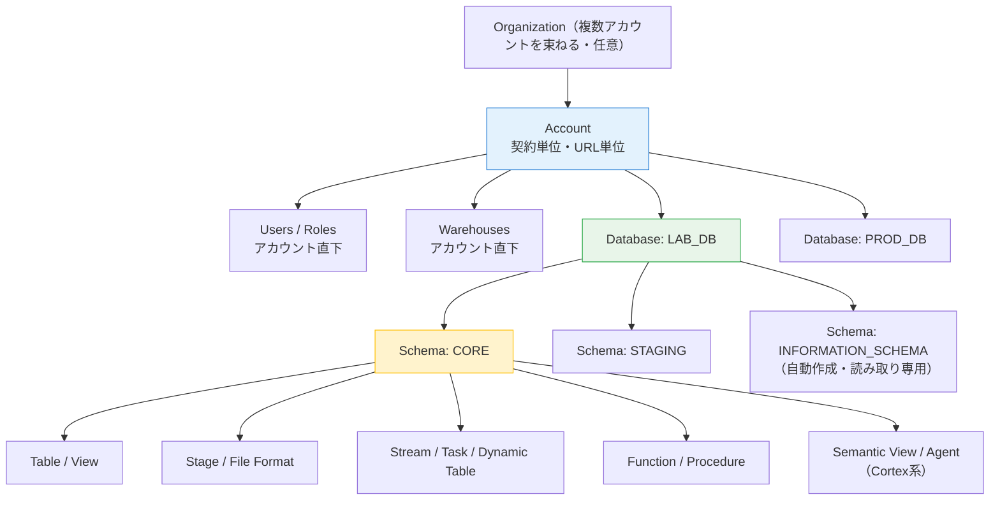

| 階層 | 特徴 |
|---|---|
| **アカウント** | URL の単位。ユーザー・ロール・ウェアハウス・データベースを保持 |
| **データベース** | スキーマの入れ物。Time Travel 期間などのパラメータをここで既定できる |
| **スキーマ** | テーブル等の入れ物。**権限設計の実質的な単位**になることが多い |
| **スキーマオブジェクト** | テーブル、ビュー、ステージ、タスク、関数など |

### 3.2 名前解決 — 「テーブルが見つかりません」の 9 割はこれ

Snowflake のオブジェクト名は **`データベース名.スキーマ名.オブジェクト名`** の 3 階層です。省略した場合、セッションの現在位置（`USE` で設定したもの）が補われます。

```sql
-- 完全修飾名（どこからでも確実に届く）
SELECT * FROM lab_db.core.orders;

-- 省略形（USE DATABASE / USE SCHEMA が設定されている前提）
USE DATABASE lab_db;
USE SCHEMA core;
SELECT * FROM orders;      -- lab_db.core.orders と解釈される

-- 現在位置の確認
SELECT CURRENT_DATABASE(), CURRENT_SCHEMA();
```

⚠️ **つまずきポイント: 大文字・小文字**
Snowflake は識別子を**既定で大文字に正規化**します。ダブルクォートで囲むと、囲んだとおりの文字が保持されます。

```sql
CREATE TABLE orders (...);      -- 実体は ORDERS
CREATE TABLE "orders" (...);    -- 実体は orders（別物！）

SELECT * FROM ORDERS;   -- OK
SELECT * FROM orders;   -- OK（大文字に正規化されて ORDERS を指す）
SELECT * FROM "orders"; -- ORDERS ではなく orders を探す → エラーになりうる
```

BI ツールや ETL ツールが自動生成した DDL でクォート付きの小文字名が作られ、手書きの SQL から見えなくなる——これは実務で頻発します。**原則、識別子をクォートで囲まない**運用にしてください。

❓ **よくある疑問: `INFORMATION_SCHEMA` と `SNOWFLAKE.ACCOUNT_USAGE` の違いは？**

| | INFORMATION_SCHEMA | SNOWFLAKE.ACCOUNT_USAGE |
|---|---|---|
| スコープ | そのデータベース内 | アカウント全体 |
| 遅延 | リアルタイム | 最大 3 時間程度 |
| 履歴保持 | 直近 7 日〜6 か月（ビューによる） | 1 年 |
| 削除済みオブジェクト | 見えない | 見える（`deleted` 列あり） |
| 用途 | 開発中の確認 | 監査・コスト分析 |

---

## 4. ウェアハウス（計算リソース）

**Snowflake の費用の 8 割前後はここです。最重要の章です。**

### 4.1 サイズと課金

ウェアハウスのサイズは T シャツサイズで表され、1 段階上げるごとに計算リソースと 1 時間あたりのクレジット消費が約 2 倍になります。

| サイズ | クレジット/時（Gen1 標準） | 目安 |
|---|---:|---|
| X-Small | 1 | 学習・軽いクエリ・Snowsight の既定 |
| Small | 2 | 小規模ロード |
| Medium | 4 | 中規模の変換処理 |
| Large | 8 | 大きめの ETL |
| X-Large | 16 | 大規模バッチ |
| 2X-Large | 32 | |
| 3X-Large | 64 | |
| 4X-Large | 128 | |
| 5X-Large | 256 | AWS / Azure で GA |
| 6X-Large | 512 | AWS / Azure で GA |

💡 **課金の重要ルール（ここを誤解すると請求書で驚きます）**

- 課金は**秒単位**。ただし**起動・再開のたびに最低 60 秒**が課金される
- **停止（SUSPEND）中はゼロ**
- クエリが終わっても、`AUTO_SUSPEND` の時間が来るまで**アイドル時間も課金される**

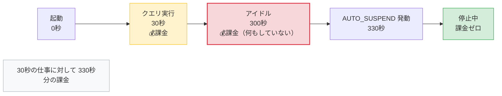

⚠️ **つまずきポイント**: 上の例では、30 秒の仕事に対して **330 秒分**課金されます。既定の `AUTO_SUSPEND` は 600 秒（10分）なので、そのままだと 630 秒です。**学習中は 60 秒に設定してください。**

### 4.2 大きくすれば速いのか

**必ずしも速くなりません。** 公式ドキュメントでも次の 2 点が明記されています。

- データロードの性能は、ウェアハウスのサイズよりも「ファイルの数と各ファイルのサイズ」に強く影響される。数百〜数千のファイルを同時にバルクロードするのでなければ、Small〜Large 程度で十分
- 小さく単純なクエリでは、大きいほうが速いとは限らない

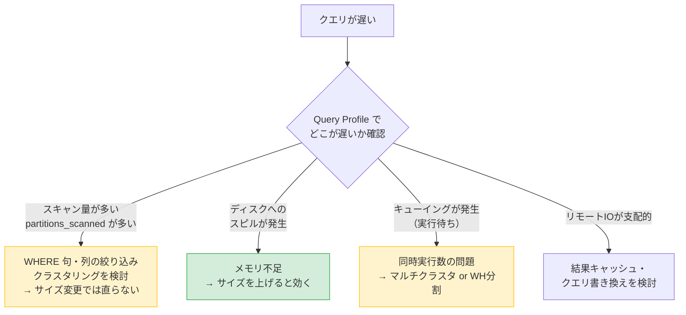

📘 **用語: スピル（Spilling）**
処理中のデータがウェアハウスのメモリに収まらず、ローカルディスクやリモートストレージに書き出されること。Query Profile に「Bytes spilled to local/remote storage」として現れます。**これが出ていたらサイズアップが正解**です。逆に出ていないのにサイズを上げても、費用が倍になるだけで速くなりません。

### 4.3 マルチクラスタウェアハウス

📘 **用語: マルチクラスタ**
同じサイズのクラスタを自動的に増減させ、**同時実行ユーザー数**に対応する機能（Enterprise Edition 以上）。サイズ変更が「1 クエリを速くする」のに対し、マルチクラスタは「多人数を捌く」ための機能です。

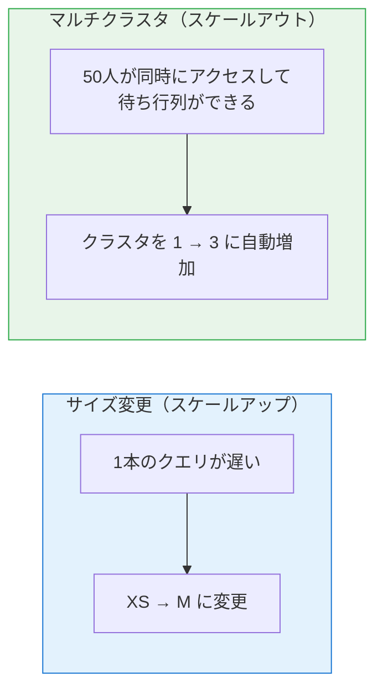

```sql
CREATE WAREHOUSE bi_wh
  WAREHOUSE_SIZE = 'MEDIUM'
  MIN_CLUSTER_COUNT = 1
  MAX_CLUSTER_COUNT = 3
  SCALING_POLICY = 'STANDARD'   -- STANDARD: 待たせない / ECONOMY: 節約優先
  AUTO_SUSPEND = 120
  AUTO_RESUME = TRUE;
```

### 4.4 キャッシュの 3 階層

Snowflake には 3 種類のキャッシュがあり、**どれが効いたかで同じクエリの速度が 100 倍変わります**。

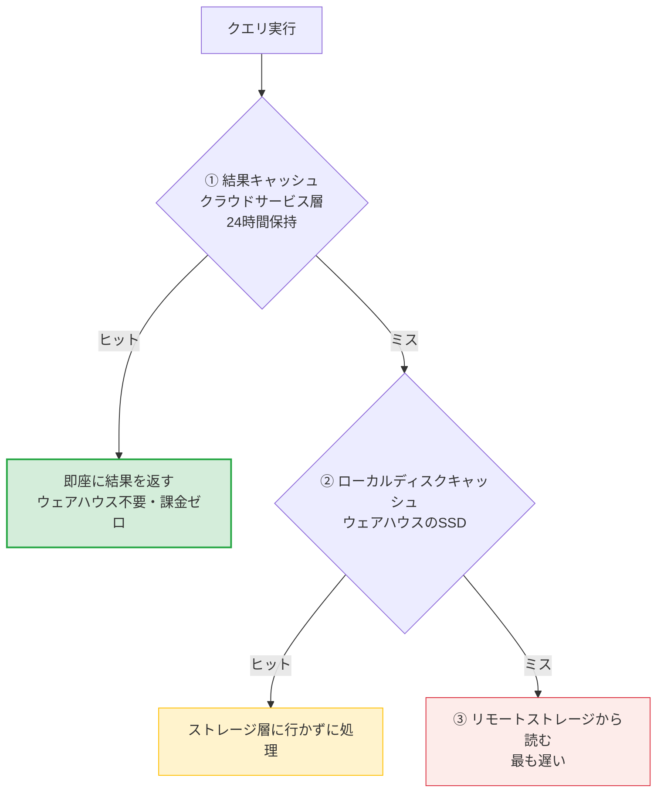

| キャッシュ | 保持場所 | 消える条件 |
|---|---|---|
| ① 結果キャッシュ | クラウドサービス層 | 24時間経過、元テーブルが変更された、クエリ文字列が1文字でも違う |
| ② ローカルディスク | ウェアハウスの SSD | **ウェアハウスを停止すると消える** |
| ③ リモートストレージ | クラウドストレージ | — |

⚠️ **つまずきポイント**: 「昨日は速かったのに今日は遅い」の典型原因が②です。`AUTO_SUSPEND` を短くすると費用は下がりますが、ローカルキャッシュが頻繁に消えます。**BI 用ウェアハウスは 300〜600 秒、バッチ用は 60 秒**、といった使い分けが実務的です。

❓ **よくある疑問: 結果キャッシュを使いたくない（性能測定したい）**

```sql
ALTER SESSION SET USE_CACHED_RESULT = FALSE;
```

### 4.5 リソースモニター（コスト暴走の防止）

```sql
USE ROLE ACCOUNTADMIN;

CREATE OR REPLACE RESOURCE MONITOR lab_monitor
  WITH CREDIT_QUOTA = 50               -- 月50クレジットまで
       FREQUENCY = MONTHLY
       START_TIMESTAMP = IMMEDIATELY
  TRIGGERS
    ON 75  PERCENT DO NOTIFY           -- 75%で通知
    ON 90  PERCENT DO SUSPEND          -- 90%で新規クエリを止める
    ON 100 PERCENT DO SUSPEND_IMMEDIATE; -- 100%で実行中も止める

ALTER WAREHOUSE lab_wh SET RESOURCE_MONITOR = lab_monitor;
```

🏢 **実務メモ**: 案件では「ウェアハウスをどう分割するか」が初期設計の要になります。定石は **用途 × 環境**（例: `WH_ETL_PROD`, `WH_BI_PROD`, `WH_ADHOC_DEV`）で分け、それぞれにリソースモニターを付ける形です。コスト按分の単位にもなります。

✅ **手を動かす（4章）**

- [ ] `SHOW WAREHOUSES;` で稼働状況とサイズを確認した
- [ ] 同じクエリを 2 回実行し、2 回目が結果キャッシュで即返ることを確認した
- [ ] `ALTER SESSION SET USE_CACHED_RESULT = FALSE;` で差を確認した
- [ ] ウェアハウスを XS → S に変更し、重いクエリの時間差を測った
- [ ] リソースモニターを作成し、ウェアハウスに紐付けた

---

## 5. テーブルの種類

### 5.1 3 種類の使い分け

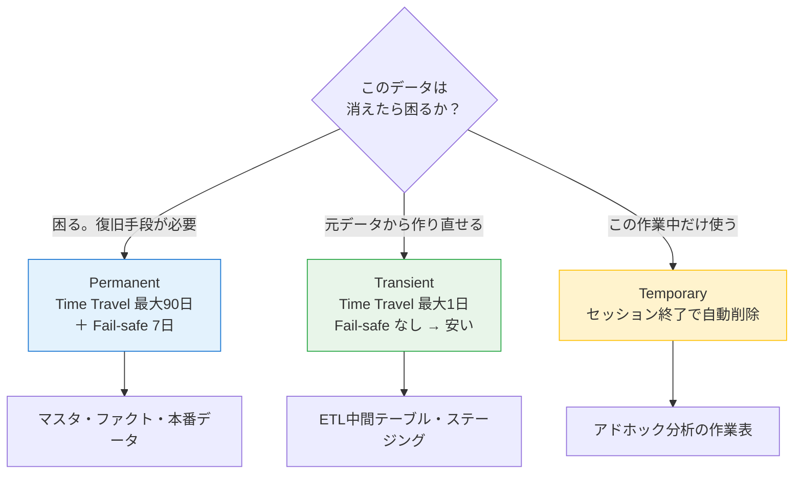

| 種類 | Time Travel | Fail-safe | ストレージ費用 | 消えるタイミング |
|---|---|---|---|---|
| **Permanent**（既定） | 0〜90日 | 7日 | 最も高い | 明示的に DROP するまで |
| **Transient** | 0〜1日 | なし | 中 | 明示的に DROP するまで |
| **Temporary** | 0〜1日 | なし | 低 | セッション終了時に自動 |

```sql
CREATE TABLE            orders_master (...);   -- Permanent
CREATE TRANSIENT TABLE  orders_staging (...);  -- Transient
CREATE TEMPORARY TABLE  tmp_calc (...);        -- Temporary
```

💡 **なぜ Transient が安いのか**
Fail-safe（後述）は、Time Travel 期間が切れた後さらに 7 日間データを保持する仕組みです。この 7 日分のストレージ費用が発生しません。**ETL の中間テーブルを Permanent で作るのは、実務で最もよくあるコストの無駄**です。

⚠️ **つまずきポイント**: Transient データベース/スキーマの中には Permanent テーブルを作れません（自動的に Transient になります）。ステージング用のスキーマごと Transient にしておくと事故が防げます。

```sql
CREATE TRANSIENT SCHEMA lab_db.staging;
```

### 5.2 主なデータ型

| 分類 | 型 | 補足 |
|---|---|---|
| 数値 | `NUMBER(p,s)`, `INT`, `FLOAT` | `INT` 等はすべて `NUMBER` の別名 |
| 文字列 | `VARCHAR(n)`, `STRING`, `TEXT` | 長さ指定は上限であり、課金は実データ量。**迷ったら `VARCHAR` でよい** |
| 日付時刻 | `DATE`, `TIME`, `TIMESTAMP_NTZ/LTZ/TZ` | 既定は `TIMESTAMP_NTZ`（タイムゾーン情報なし） |
| 半構造化 | `VARIANT`, `OBJECT`, `ARRAY` | JSON をそのまま入れられる |
| 論理 | `BOOLEAN` | |

⚠️ **つまずきポイント: タイムゾーン**
`TIMESTAMP_NTZ`（No Time Zone）はタイムゾーンを持ちません。JST のつもりで入れたデータを UTC 前提のツールが読むとズレます。**セッションパラメータを明示する**か、`TIMESTAMP_TZ` を使ってください。

```sql
ALTER SESSION SET TIMEZONE = 'Asia/Tokyo';
SELECT CURRENT_TIMESTAMP();
```

### 5.3 半構造化データ（VARIANT）

Snowflake の強力な特徴です。**JSON をパースせずにそのまま入れて、SQL で掘れます。**

```sql
CREATE OR REPLACE TABLE events (
  event_id NUMBER,
  payload  VARIANT
);

INSERT INTO events
SELECT 1, PARSE_JSON('{"user":{"id":"u001","plan":"pro"},"items":[{"sku":"A1","qty":2},{"sku":"B2","qty":1}]}');

-- ドット記法で掘る（: が第1階層、. が以降）
SELECT
  payload:user.id::STRING       AS user_id,
  payload:user.plan::STRING     AS plan,
  payload:items[0].sku::STRING  AS first_sku
FROM events;

-- 配列を行に展開する
SELECT
  e.event_id,
  f.value:sku::STRING AS sku,
  f.value:qty::NUMBER AS qty
FROM events e,
     LATERAL FLATTEN(input => e.payload:items) f;
```

📘 **用語: FLATTEN**
配列やオブジェクトを行に展開する関数。`LATERAL FLATTEN` は「各行に対して展開を適用する」書き方で、JSON 処理の定番構文です。

⚠️ **つまずきポイント**: `payload:user.id` の戻り値は VARIANT 型で、文字列として使うと `"u001"` のようにダブルクォート付きになります。**必ず `::STRING` などでキャストしてください。**

✅ **手を動かす（5章）**

- [ ] Permanent / Transient / Temporary を 1 つずつ作り、`SHOW TABLES;` の `kind` 列を確認した
- [ ] JSON を VARIANT に入れ、ドット記法と `FLATTEN` で取り出した
- [ ] `::STRING` を付けた場合と付けない場合の出力差を確認した

---

## 6. Time Travel — 過去に戻る

### 6.1 何ができるか

データが変更・削除されたとき、Snowflake は変更前の状態を保持します。保持日数（データ保持期間）の範囲内であれば、過去時点のデータを SELECT したり、削除したオブジェクトを復元したりできます。

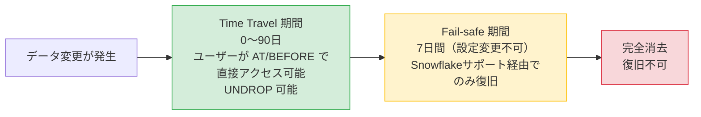

| エディション | Time Travel 最大 | Fail-safe | 合計保護期間 |
|---|---|---|---|
| Standard | 1日 | 7日 | 8日 |
| Enterprise 以上 | 90日 | 7日 | 97日 |

📘 **用語: Fail-safe**
Time Travel が切れた後の**最後の砦**。7 日間・設定変更不可で、**ユーザーは直接アクセスできません**。Snowflake サポートに依頼して復旧してもらう仕組みです。「バックアップ」ではなく「災害時の保険」と理解してください。

### 6.2 使い方

```sql
-- 保持期間の設定（テーブル単位でも可）
ALTER TABLE orders SET DATA_RETENTION_TIME_IN_DAYS = 7;

-- ① 5分前の状態を見る
SELECT * FROM orders AT(OFFSET => -60*5);

-- ② 特定時刻の状態を見る
SELECT * FROM orders AT(TIMESTAMP => '2026-08-01 09:00:00'::TIMESTAMP_LTZ);

-- ③ 特定のクエリ実行「直前」の状態を見る（事故った UPDATE の直前）
SELECT * FROM orders BEFORE(STATEMENT => '01b2c3d4-0000-...');

-- ④ 誤って消したテーブルを戻す
UNDROP TABLE orders;

-- ⑤ 事故前の状態でテーブルを復元する（安全な手順）
CREATE OR REPLACE TABLE orders_restored CLONE orders BEFORE(STATEMENT => '01b2c3d4-...');
-- 中身を確認してから入れ替える
```

💡 **なぜ ③ が実務で最強か**
事故は「時刻」ではなく「あの UPDATE 文」で起きます。Query History からクエリ ID を拾い、その直前に戻すのが最も正確です。

```sql
-- 事故ったクエリの ID を探す
SELECT query_id, query_text, user_name, start_time
FROM SNOWFLAKE.ACCOUNT_USAGE.QUERY_HISTORY
WHERE query_text ILIKE '%UPDATE orders%'
  AND start_time >= DATEADD('day', -1, CURRENT_TIMESTAMP())
ORDER BY start_time DESC;
```

⚠️ **つまずきポイント: Time Travel はストレージ費用を食う**
毎日全行を `UPDATE` するようなテーブルで保持期間を 90 日にすると、**同じテーブルの 90 世代分**が保持されます。テーブル種別と保持期間はセットで設計してください。

```sql
-- ストレージの内訳を確認する
SELECT table_name,
       ROUND(active_bytes/1024/1024/1024, 2)      AS active_gb,
       ROUND(time_travel_bytes/1024/1024/1024, 2) AS time_travel_gb,
       ROUND(failsafe_bytes/1024/1024/1024, 2)    AS failsafe_gb
FROM SNOWFLAKE.ACCOUNT_USAGE.TABLE_STORAGE_METRICS
WHERE table_catalog = 'LAB_DB'
ORDER BY time_travel_gb DESC;
```

❓ **よくある疑問: `UNDROP` が失敗する**
同名のオブジェクトが既に存在すると失敗します。既存を `ALTER TABLE ... RENAME TO ...` で改名してから `UNDROP` してください。

---

## 7. ゼロコピークローン

### 7.1 概要

**データを物理コピーせずに、テーブル・スキーマ・データベースを丸ごと複製する機能**です。

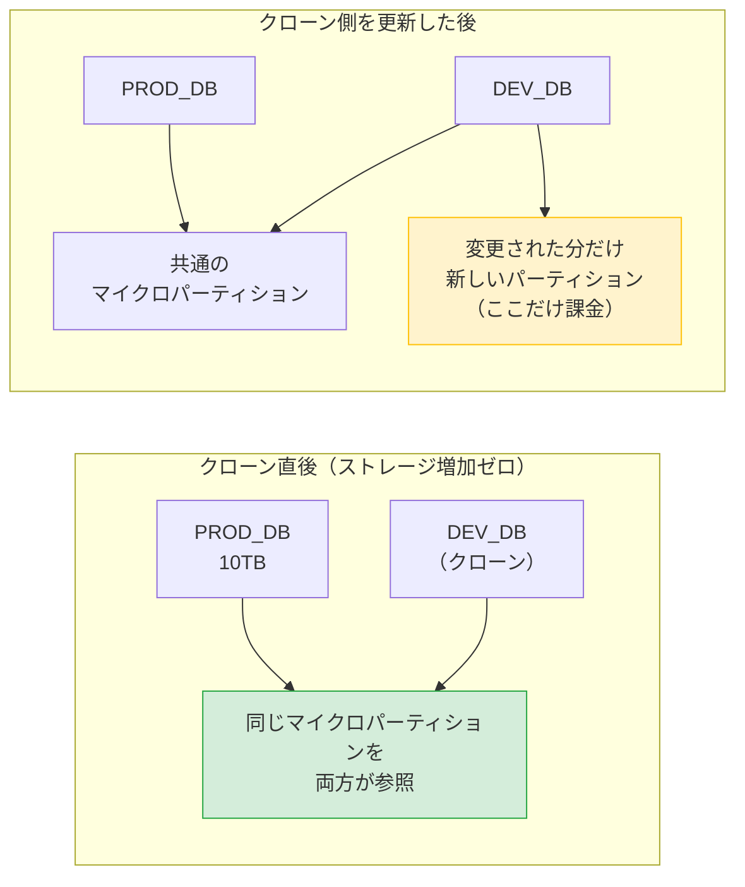

💡 **なぜ無料で瞬時なのか**
クローンはメタデータ上で「同じマイクロパーティションを指す新しい名前」を作るだけだからです。10TB のデータベースのクローンが数秒で終わり、直後のストレージ増加はゼロです。**変更を加えた部分だけ**が新しいパーティションとして課金されます。

### 7.2 使い方

```sql
-- 本番相当の検証環境を一瞬で作る
CREATE DATABASE dev_db CLONE prod_db;

-- 過去時点のクローン（Time Travel と組み合わせる）
CREATE TABLE orders_20260801 CLONE orders AT(TIMESTAMP => '2026-08-01 00:00:00'::TIMESTAMP_LTZ);

-- リリース前のバックアップとして
CREATE TRANSIENT SCHEMA core_backup_20260804 CLONE core;
```

🏢 **実務メモ: クローンの定番用途**

| 用途 | 説明 |
|---|---|
| 検証環境の払い出し | 本番と同じデータで開発できる。使い終わったら DROP |
| リリース前バックアップ | デプロイ直前にスキーマごとクローン。切り戻しが一瞬 |
| A/B のデータ比較 | 変換ロジック変更前後の結果を並べて比較 |
| 監査時点のスナップショット | 決算時点のデータを固定 |

⚠️ **つまずきポイント: クローンで引き継がれないもの**
- ロード履歴（`COPY INTO` の重複排除メタデータ）は引き継がれる／引き継がれないがオブジェクトにより異なる
- **付与済みの権限は、既定では引き継がれません**（`COPY GRANTS` を付ける必要あり）

```sql
CREATE TABLE orders_clone CLONE orders COPY GRANTS;
```

✅ **手を動かす（6-7章）**

- [ ] テーブルを作り、`UPDATE` した後 `AT(OFFSET => -60)` で変更前を見た
- [ ] `DROP TABLE` → `UNDROP TABLE` で復元した
- [ ] `TABLE_STORAGE_METRICS` で Time Travel のストレージ量を見た
- [ ] スキーマをクローンし、ストレージが増えていないことを確認した
- [ ] クローン側だけを更新し、元テーブルが変わらないことを確認した

---

## 8. Snowsight（Web UI）の歩き方

| メニュー | 用途 |
|---|---|
| **Projects » Worksheets** | SQL を書く。ここが主戦場 |
| **Projects » Notebooks** | Python + SQL のノートブック |
| **Projects » Streamlit** | データアプリの作成 |
| **Data » Databases** | オブジェクトの階層をブラウズ |
| **Data » Marketplace** | 外部データセットの取得 |
| **Monitoring » Query History** | クエリの実行履歴・Query Profile |
| **Admin » Warehouses** | ウェアハウスの管理 |
| **Admin » Cost Management** | コストの可視化（**遅延なし**） |
| **Admin » Users & Roles** | ユーザー・ロール管理 |
| **AI & ML** | Cortex 系機能（→ 04巻） |

💡 **Query Profile の見方（最重要スキル）**
Query History から任意のクエリを開き、`Query Profile` タブを見ます。確認すべき順序は次のとおりです。

1. **Most Expensive Nodes** — どのステップが時間を食っているか
2. **Partitions scanned / total** — プルーニングが効いているか
3. **Bytes spilled to local/remote storage** — メモリ不足が起きていないか
4. **Bytes sent over network** — 不要なデータ移動がないか

---

## 9. この巻のまとめ

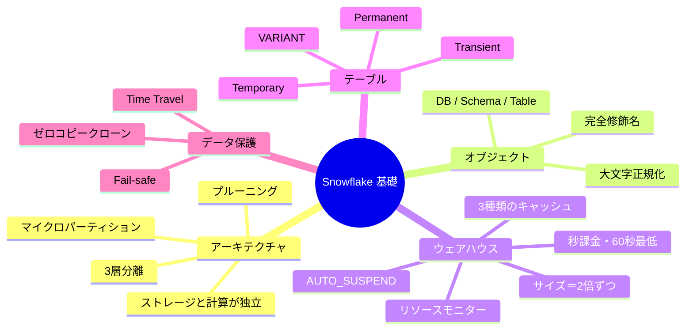

### この巻の理解度チェック

- [ ] 「ウェアハウス」がデータの置き場所ではないと説明できる
- [ ] `partitions_scanned / partitions_total` が何を意味するか説明できる
- [ ] クエリが遅いとき、サイズアップで直る場合と直らない場合を切り分けられる
- [ ] ETL 中間テーブルを Transient にすべき理由を説明できる
- [ ] Time Travel と Fail-safe の違いを説明できる
- [ ] クローンが瞬時かつ無料である理由を説明できる

**次は → `02-snowflake-data-engineering.md`**
