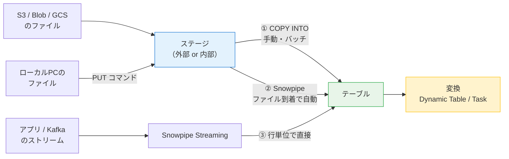
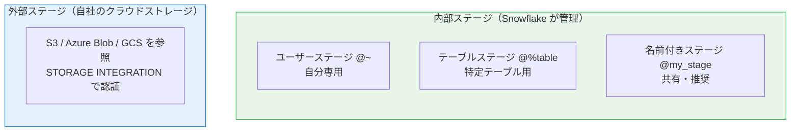
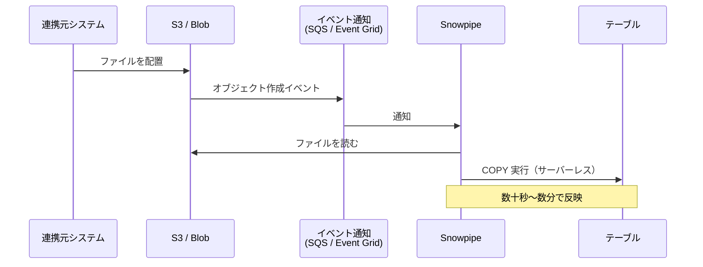
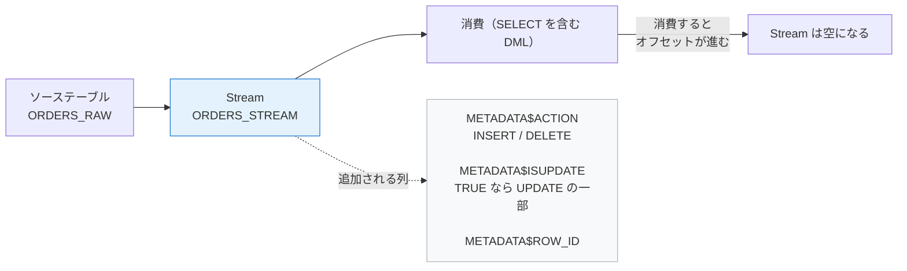
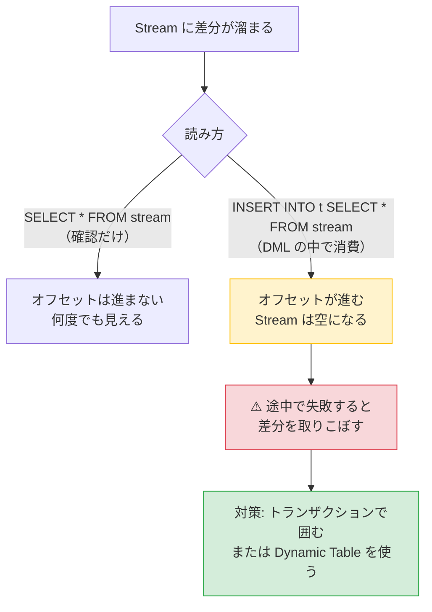
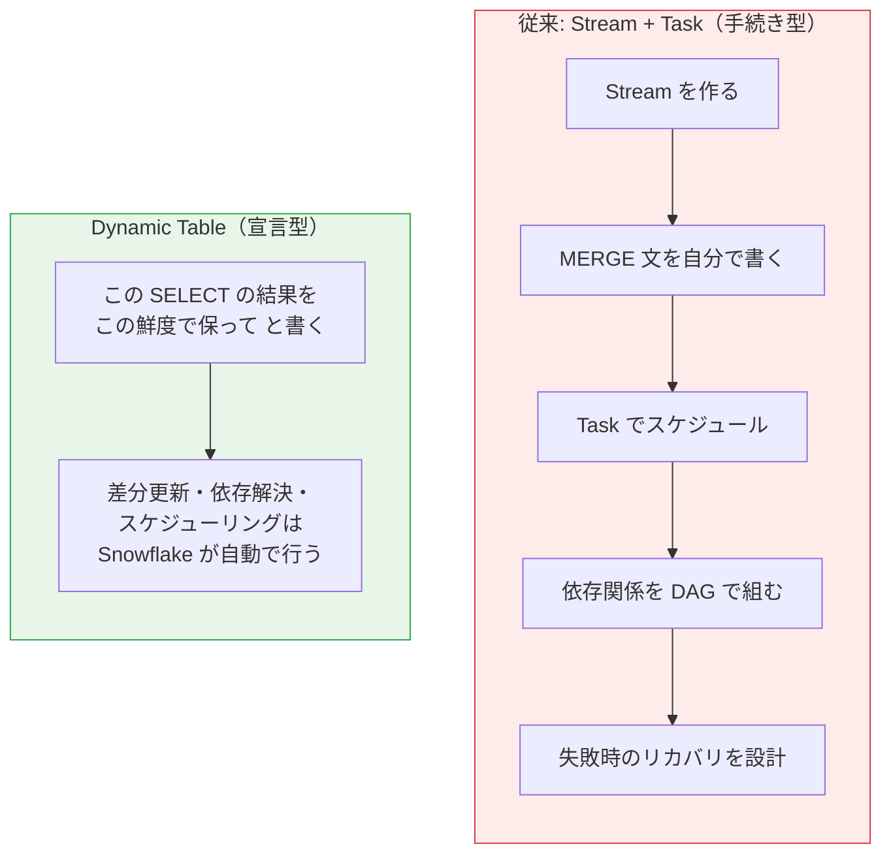
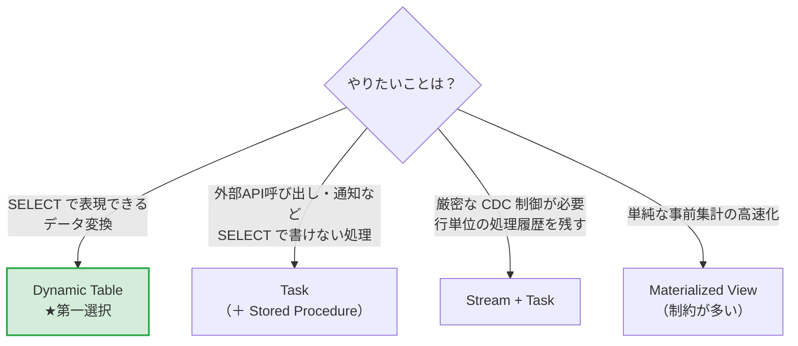
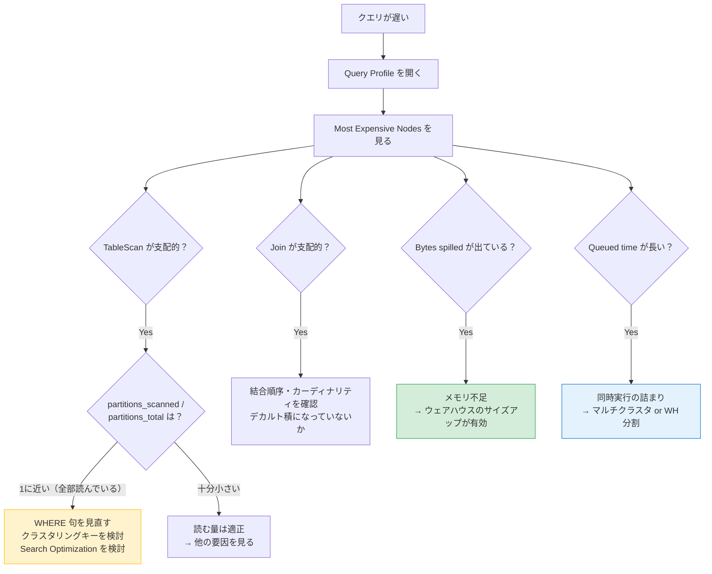
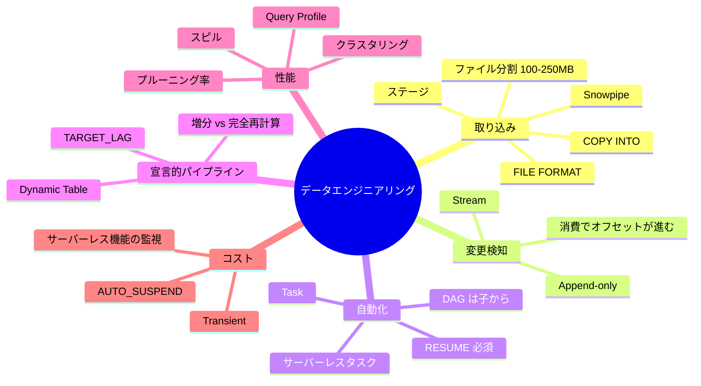

# 02 Snowflake データエンジニアリング編

> **この巻で分かること**
> - ファイルを Snowflake に取り込む 3 つの方法と、その使い分け
> - 変更差分を捉える Stream と、処理を自動実行する Task
> - パイプラインを宣言的に書ける Dynamic Table（現在の第一選択）
> - クエリが遅いときの調査手順と、クラスタリングの判断基準
> - コストを下げる具体的な打ち手
>
> **前提知識**: `01-snowflake-basics.md`（特にマイクロパーティションとウェアハウス）

---

## 1. データ取り込みの全体像



| 方法 | 遅延 | 課金 | 使いどころ |
|---|---|---|---|
| **① COPY INTO** | 手動実行時 | ウェアハウス | 初期ロード、日次バッチ |
| **② Snowpipe** | 数十秒〜数分 | サーバーレス（ファイル数ベース） | ファイルが継続的に届く連携 |
| **③ Snowpipe Streaming** | 秒単位 | サーバーレス | アプリ・Kafka からのリアルタイム |

🏢 **実務メモ**: 案件で「リアルタイムにしたい」と言われたら、まず**本当に秒単位が必要か**を確認してください。Snowpipe（数分遅延）で足りるケースが大半で、その方が実装も費用もはるかに軽くなります。

---

## 2. ステージとファイル形式

### 2.1 ステージとは

📘 **用語: ステージ（Stage）**
Snowflake がファイルを読み書きする「置き場所」を指すオブジェクト。テーブルとは別物です。



### 2.2 ハンズオン: ローカルの CSV を取り込む

```sql
USE ROLE lab_role; USE WAREHOUSE lab_wh; USE SCHEMA lab_db.core;

-- ① ファイル形式を定義（再利用できるオブジェクト）
CREATE OR REPLACE FILE FORMAT csv_jp
  TYPE = CSV
  FIELD_DELIMITER = ','
  SKIP_HEADER = 1
  FIELD_OPTIONALLY_ENCLOSED_BY = '"'
  NULL_IF = ('', 'NULL', 'null')
  EMPTY_FIELD_AS_NULL = TRUE
  ENCODING = 'UTF8'
  DATE_FORMAT = 'YYYY-MM-DD'
  TIMESTAMP_FORMAT = 'YYYY-MM-DD HH24:MI:SS';

-- ② 名前付き内部ステージを作る
CREATE OR REPLACE STAGE my_stage FILE_FORMAT = csv_jp;

-- ③ ローカルファイルをアップロード（SnowSQL / Snowflake CLI から実行）
--    PUT file:///Users/me/data/orders.csv @my_stage AUTO_COMPRESS=TRUE;

-- ④ 中身を確認（ロード前に必ずやる）
LIST @my_stage;
SELECT $1, $2, $3 FROM @my_stage/orders.csv (FILE_FORMAT => csv_jp) LIMIT 10;

-- ⑤ ロード
CREATE OR REPLACE TABLE orders_raw (
  order_id NUMBER, customer_id NUMBER, order_date DATE, amount NUMBER(12,2)
);

COPY INTO orders_raw
FROM @my_stage/orders.csv
FILE_FORMAT = (FORMAT_NAME = csv_jp)
ON_ERROR = 'CONTINUE';        -- エラー行をスキップして続行
```

💡 **`SELECT $1, $2 FROM @stage` はロード前検証の必殺技です。** ステージ上のファイルをテーブルに入れずに SQL で覗けます。文字化け・区切り位置ずれ・ヘッダ行の混入を、ロード前に発見できます。

### 2.3 `ON_ERROR` の選択

| 値 | 挙動 | 使いどころ |
|---|---|---|
| `ABORT_STATEMENT`（既定） | 1行でもエラーがあれば全体を中止 | 品質が保証されたデータ |
| `CONTINUE` | エラー行をスキップして続行 | 汚れたデータの初期調査 |
| `SKIP_FILE` | エラーのあったファイル全体をスキップ | ファイル単位で整合性が必要 |
| `SKIP_FILE_<n>` | n 行以上エラーならファイルをスキップ | 実務での折衷案 |

```sql
-- ロード結果とエラー内容を確認する
SELECT * FROM TABLE(INFORMATION_SCHEMA.COPY_HISTORY(
  TABLE_NAME => 'ORDERS_RAW',
  START_TIME => DATEADD('hour', -1, CURRENT_TIMESTAMP())
));

-- エラーの詳細を検証だけする（実際にはロードしない）
COPY INTO orders_raw FROM @my_stage/orders.csv
  FILE_FORMAT = (FORMAT_NAME = csv_jp)
  VALIDATION_MODE = 'RETURN_ERRORS';
```

⚠️ **つまずきポイント: COPY は同じファイルを二度読まない**
`COPY INTO` はロード済みファイルのメタデータを **64 日間**保持し、同じファイルを再ロードしません。「もう一度入れたのに増えない」はこれが原因です。意図的に再ロードするには `FORCE = TRUE` を付けます。

### 2.4 外部ステージ（S3 / Azure Blob）

```sql
USE ROLE ACCOUNTADMIN;

-- Azure Blob の例
CREATE OR REPLACE STORAGE INTEGRATION azure_int
  TYPE = EXTERNAL_STAGE
  STORAGE_PROVIDER = 'AZURE'
  AZURE_TENANT_ID = '<tenant-id>'
  ENABLED = TRUE
  STORAGE_ALLOWED_LOCATIONS = ('azure://<account>.blob.core.windows.net/<container>/');

-- 表示された同意 URL でテナント側の承認を行う
DESC STORAGE INTEGRATION azure_int;

CREATE OR REPLACE STAGE ext_stage
  STORAGE_INTEGRATION = azure_int
  URL = 'azure://<account>.blob.core.windows.net/<container>/raw/'
  FILE_FORMAT = csv_jp;
```

💡 **なぜ STORAGE INTEGRATION を使うのか**
ステージに直接アクセスキーを書く方法もありますが、**認証情報が SQL 定義に残ります**。STORAGE INTEGRATION は Snowflake のサービスプリンシパルに権限を委譲する方式で、キーの持ち回りが不要になります。実務では原則こちらです。

### 2.5 ファイル分割のベストプラクティス

⚠️ **ロード性能はウェアハウスサイズよりファイル構成で決まります。**

| 指針 | 理由 |
|---|---|
| 1 ファイル **100〜250MB（圧縮後）** を目安に分割 | 小さすぎるとオーバーヘッド、大きすぎると並列化できない |
| 巨大な 1 ファイルは避ける | 並列処理できず、1 スレッドで処理される |
| 大量の極小ファイルも避ける | ファイル単位のメタデータ処理がボトルネックになる |
| 圧縮形式は gzip が無難 | 自動で解凍される |

---

## 3. Snowpipe — ファイル到着で自動ロード



```sql
CREATE OR REPLACE PIPE orders_pipe
  AUTO_INGEST = TRUE
AS
  COPY INTO orders_raw
  FROM @ext_stage
  FILE_FORMAT = (FORMAT_NAME = csv_jp);

-- 状態確認
SELECT SYSTEM$PIPE_STATUS('orders_pipe');

-- ロード履歴
SELECT * FROM TABLE(INFORMATION_SCHEMA.COPY_HISTORY(
  TABLE_NAME => 'ORDERS_RAW', START_TIME => DATEADD('day', -1, CURRENT_TIMESTAMP())));
```

💡 **課金の違い**: Snowpipe はウェアハウスを使わず、**サーバーレスのコンピュートを処理ファイル数に応じて消費**します。ウェアハウスの起動待ちがなく、常時稼働させる必要もありません。

⚠️ **つまずきポイント**: クラウド側のイベント通知設定（SQS / Event Grid）を作らないと `AUTO_INGEST` は動きません。`DESC PIPE` で表示される通知チャネル ARN / URL をクラウド側に登録する手順が必須です。

---

## 4. Stream — 変更差分を捉える

### 4.1 概念

📘 **用語: Stream（ストリーム）**
テーブルに対する変更（INSERT / UPDATE / DELETE）を追跡するオブジェクト。**CDC（Change Data Capture）を実現します。**



```sql
CREATE OR REPLACE STREAM orders_stream ON TABLE orders_raw;

-- ソースを変更
INSERT INTO orders_raw VALUES (1001, 5, '2026-08-01', 12000);
UPDATE orders_raw SET amount = 15000 WHERE order_id = 1001;

-- 差分を見る
SELECT *, METADATA$ACTION, METADATA$ISUPDATE FROM orders_stream;
```

⚠️ **つまずきポイント（最重要）: Stream は「消費」で空になる**
Stream を **DML（INSERT / MERGE 等）の中で読むと、オフセットが進んで内容が消えます**。単なる `SELECT` では消えません。



### 4.2 Stream の種類

| 種類 | 追跡内容 | 用途 |
|---|---|---|
| **Standard**（既定） | INSERT / UPDATE / DELETE すべて | 一般的な CDC |
| **Append-only** | INSERT のみ | ログ系。軽量で高速 |
| **Insert-only** | 外部テーブル用の INSERT のみ | 外部テーブル |

```sql
CREATE OR REPLACE STREAM log_stream ON TABLE app_logs APPEND_ONLY = TRUE;
```

---

## 5. Task — 処理の自動実行

```sql
-- ① スケジュール実行
CREATE OR REPLACE TASK load_orders_task
  WAREHOUSE = lab_wh
  SCHEDULE  = 'USING CRON 0 3 * * * Asia/Tokyo'   -- 毎日3:00 JST
AS
  MERGE INTO orders_dim d
  USING orders_stream s ON d.order_id = s.order_id
  WHEN MATCHED THEN UPDATE SET d.amount = s.amount
  WHEN NOT MATCHED THEN INSERT (order_id, amount) VALUES (s.order_id, s.amount);

-- ② 依存関係のあるタスク（DAG）
CREATE OR REPLACE TASK aggregate_task
  WAREHOUSE = lab_wh
  AFTER load_orders_task
AS
  INSERT OVERWRITE INTO daily_summary SELECT order_date, SUM(amount) FROM orders_dim GROUP BY 1;

-- ③ Stream に差分があるときだけ動かす（無駄な起動を防ぐ）
ALTER TASK load_orders_task SET
  WHEN = SYSTEM$STREAM_HAS_DATA('orders_stream');

-- ④ タスクは作成直後は停止状態。子 → 親の順で起動する
ALTER TASK aggregate_task RESUME;
ALTER TASK load_orders_task RESUME;
```

⚠️ **つまずきポイント（頻出）**

1. **タスクは作成しただけでは動きません。** `RESUME` が必要です
2. **DAG は子から先に RESUME します。** 親（ルート）を先に起動すると、子が停止したまま走ります
3. ルートタスクを変更するときは、いったん `SUSPEND` する必要があります

```sql
-- 実行履歴の確認
SELECT name, state, scheduled_time, completed_time, error_message
FROM TABLE(INFORMATION_SCHEMA.TASK_HISTORY(
  SCHEDULED_TIME_RANGE_START => DATEADD('day', -1, CURRENT_TIMESTAMP())))
ORDER BY scheduled_time DESC;
```

💡 **サーバーレスタスク**: `WAREHOUSE` を指定しない代わりに `USER_TASK_MANAGED_INITIAL_WAREHOUSE_SIZE` を指定すると、Snowflake が計算リソースを自動で割り当てます。短時間・低頻度のタスクではこちらが安くなることが多いです。

---

## 6. Dynamic Table — 宣言的パイプライン（現在の第一選択）

### 6.1 Stream + Task との比較



📘 **用語: TARGET_LAG（目標ラグ）**
「元データの変更から何分以内に、この結果を追随させたいか」を宣言する設定。Snowflake はこれを満たすように更新頻度を自動決定します。

```sql
CREATE OR REPLACE DYNAMIC TABLE daily_sales
  TARGET_LAG = '5 minutes'
  WAREHOUSE  = lab_wh
AS
  SELECT o.order_date,
         c.c_mktsegment AS segment,
         SUM(o.amount)  AS total_sales,
         COUNT(*)       AS order_count
  FROM orders_raw o
  JOIN customers   c ON c.customer_id = o.customer_id
  GROUP BY 1, 2;

-- 依存関係は自動解決される（下流は上流に追随）
CREATE OR REPLACE DYNAMIC TABLE monthly_sales
  TARGET_LAG = DOWNSTREAM        -- 下流の要求に合わせる
  WAREHOUSE  = lab_wh
AS
  SELECT DATE_TRUNC('month', order_date) AS ym, segment, SUM(total_sales) AS total
  FROM daily_sales GROUP BY 1, 2;
```

```sql
-- 状態とリフレッシュ履歴
SHOW DYNAMIC TABLES;
SELECT * FROM TABLE(INFORMATION_SCHEMA.DYNAMIC_TABLE_REFRESH_HISTORY())
ORDER BY refresh_start_time DESC LIMIT 20;
```

### 6.2 増分更新の制約（重要）

Dynamic Table は可能な限り**増分更新（変更分だけ再計算）**しますが、クエリの内容によっては**完全再計算**にフォールバックします。完全再計算はコストが跳ね上がります。

| 増分更新しやすい | 増分更新が難しい（完全再計算になりやすい） |
|---|---|
| `SELECT`, `WHERE`, 内部結合 | 一部のウィンドウ関数 |
| `GROUP BY` + `SUM/COUNT/MIN/MAX` | `LATERAL FLATTEN` を含む一部の構文 |
| `UNION ALL` | 非決定的関数（`CURRENT_TIMESTAMP()` 等） |
| — | 外部テーブルへの参照 |

```sql
-- どちらのモードで動いているか確認する
SELECT name, refresh_mode, refresh_mode_reason
FROM TABLE(INFORMATION_SCHEMA.DYNAMIC_TABLES());
```

🏢 **実務メモ**: `refresh_mode` が `FULL` になっていたら、`refresh_mode_reason` に理由が書かれています。**クエリを書き換えて `INCREMENTAL` に持っていけるかが、Dynamic Table 設計の腕の見せ所**です。

> 💡 **04 巻とのつながり**: Cortex Search サービスのリフレッシュは、この Dynamic Table と同じ増分更新の制約に従います。ソースクエリが増分更新に対応していないと、検索サービスの作成自体が失敗します。

### 6.3 使い分け



---

## 7. 性能チューニング

### 7.1 調査の手順



```sql
-- 遅いクエリの棚卸し
SELECT query_id,
       LEFT(query_text, 80)                AS q,
       warehouse_name,
       total_elapsed_time/1000             AS sec,
       partitions_scanned, partitions_total,
       bytes_spilled_to_local_storage      AS spill_local,
       bytes_spilled_to_remote_storage     AS spill_remote,
       queued_overload_time/1000           AS queued_sec
FROM SNOWFLAKE.ACCOUNT_USAGE.QUERY_HISTORY
WHERE start_time >= DATEADD('day', -1, CURRENT_TIMESTAMP())
  AND total_elapsed_time > 10000
ORDER BY total_elapsed_time DESC
LIMIT 20;
```

### 7.2 クラスタリングキー

📘 **用語: クラスタリングキー**
マイクロパーティション内のデータの並び順を、指定した列で自動的に整える機能。プルーニングの効きを改善します。

⚠️ **クラスタリングは「困ってから」入れる機能です。** 自動クラスタリングはバックグラウンドで継続的にクレジットを消費します。最初から全テーブルに付けるのは典型的な無駄です。

**検討する条件（すべて満たす場合のみ）**

- テーブルが概ね **1TB 以上**
- 特定の列で頻繁に絞り込んでいる
- `SYSTEM$CLUSTERING_INFORMATION` で重なりが大きいと判明している

```sql
-- 現状のクラスタリング状態を診断
SELECT SYSTEM$CLUSTERING_INFORMATION('orders_raw', '(order_date)');
-- average_overlaps / average_depth が大きいほど非効率

-- 設定
ALTER TABLE orders_raw CLUSTER BY (order_date, region);

-- 自動クラスタリングのコストを監視
SELECT table_name, SUM(credits_used) AS credits
FROM SNOWFLAKE.ACCOUNT_USAGE.AUTOMATIC_CLUSTERING_HISTORY
WHERE start_time >= DATEADD('day', -30, CURRENT_TIMESTAMP())
GROUP BY 1 ORDER BY 2 DESC;
```

💡 **キーの選び方**: カーディナリティが高すぎる列（主キーなど）は不適です。**日付 → 地域 → カテゴリ**のように、粗い順に 3〜4 列までが目安です。

### 7.3 その他の高速化手段

| 機能 | 効く場面 | 注意 |
|---|---|---|
| **Search Optimization Service** | 巨大テーブルへのポイントルックアップ（`WHERE id = ...`） | 維持コストが高い（Enterprise 以上） |
| **Materialized View** | 決まった事前集計の再利用 | 制約が多く、Dynamic Table で代替できることが多い |
| **Query Acceleration Service** | スキャン量が突出したクエリの部分的な並列化 | Enterprise 以上 |
| **Result Cache** | 同一クエリの再実行 | 無料・自動 |

---

## 8. コスト最適化の実践

### 8.1 費用の内訳を掴む

```sql
-- 過去30日をサービス種別で
SELECT service_type, ROUND(SUM(credits_used), 1) AS credits
FROM SNOWFLAKE.ACCOUNT_USAGE.METERING_HISTORY
WHERE start_time >= DATEADD('day', -30, CURRENT_TIMESTAMP())
GROUP BY 1 ORDER BY 2 DESC;

-- ウェアハウス別
SELECT warehouse_name, ROUND(SUM(credits_used), 1) AS credits
FROM SNOWFLAKE.ACCOUNT_USAGE.WAREHOUSE_METERING_HISTORY
WHERE start_time >= DATEADD('day', -30, CURRENT_TIMESTAMP())
GROUP BY 1 ORDER BY 2 DESC;

-- アイドル時間の割合（＝無駄の指標）
SELECT warehouse_name,
       ROUND(SUM(credits_used), 1) AS total_credits,
       ROUND(SUM(credits_used_compute), 1) AS compute_credits
FROM SNOWFLAKE.ACCOUNT_USAGE.WAREHOUSE_METERING_HISTORY
WHERE start_time >= DATEADD('day', -7, CURRENT_TIMESTAMP())
GROUP BY 1;
```

### 8.2 打ち手チェックリスト

| # | 打ち手 | 効果 |
|---|---|---|
| 1 | `AUTO_SUSPEND` を用途別に見直す（バッチ60秒 / BI 300秒） | 大 |
| 2 | ETL 中間テーブルを Transient にする | 中（ストレージ） |
| 3 | `DATA_RETENTION_TIME_IN_DAYS` をテーブル特性ごとに設定 | 中（ストレージ） |
| 4 | `SELECT *` を排除する | 大 |
| 5 | 巨大テーブルへのアドホッククエリに `LIMIT` と `WHERE` を強制する運用 | 中 |
| 6 | 使っていないクラスタリング／Search Optimization を外す | 中 |
| 7 | リソースモニターで上限を設定する | 事故防止 |
| 8 | Snowpipe の小さすぎるファイルをまとめる | 中 |

⚠️ **見落としやすい費用**

- **アイドル時間**: クエリが終わっても `AUTO_SUSPEND` まで課金される
- **Time Travel のストレージ**: 更新が多いテーブルほど膨らむ
- **サーバーレス機能**: 自動クラスタリング、Materialized View 維持、Snowpipe、Search Optimization はウェアハウスとは別枠で継続課金される

---

## 9. この巻のまとめ



### 理解度チェック

- [ ] COPY / Snowpipe / Snowpipe Streaming を使い分けられる
- [ ] `SELECT $1 FROM @stage` が何のために使えるか説明できる
- [ ] Stream が「消費で空になる」意味を説明できる
- [ ] Task を作っただけでは動かない理由を知っている
- [ ] Dynamic Table が完全再計算に落ちる原因を調べられる
- [ ] クエリが遅いとき、サイズアップが効く場合と効かない場合を切り分けられる
- [ ] クラスタリングを入れるべきかの判断基準を言える

**次は → `03-snowflake-governance-dev.md`**
