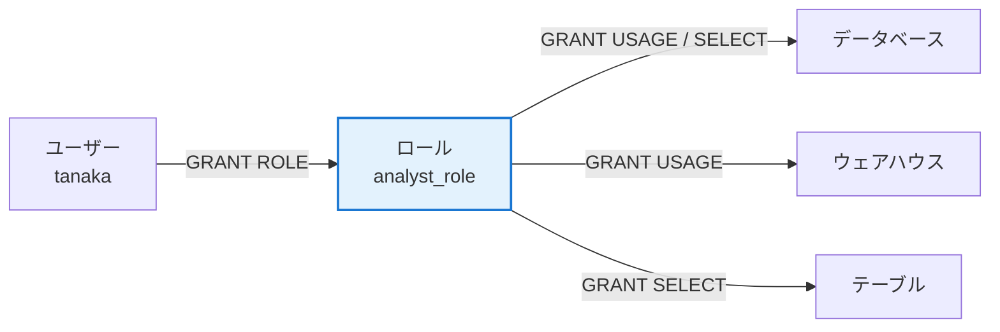
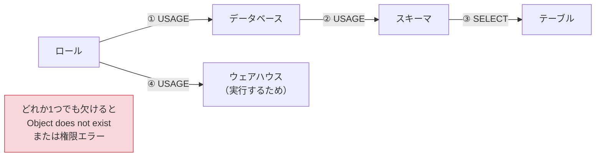
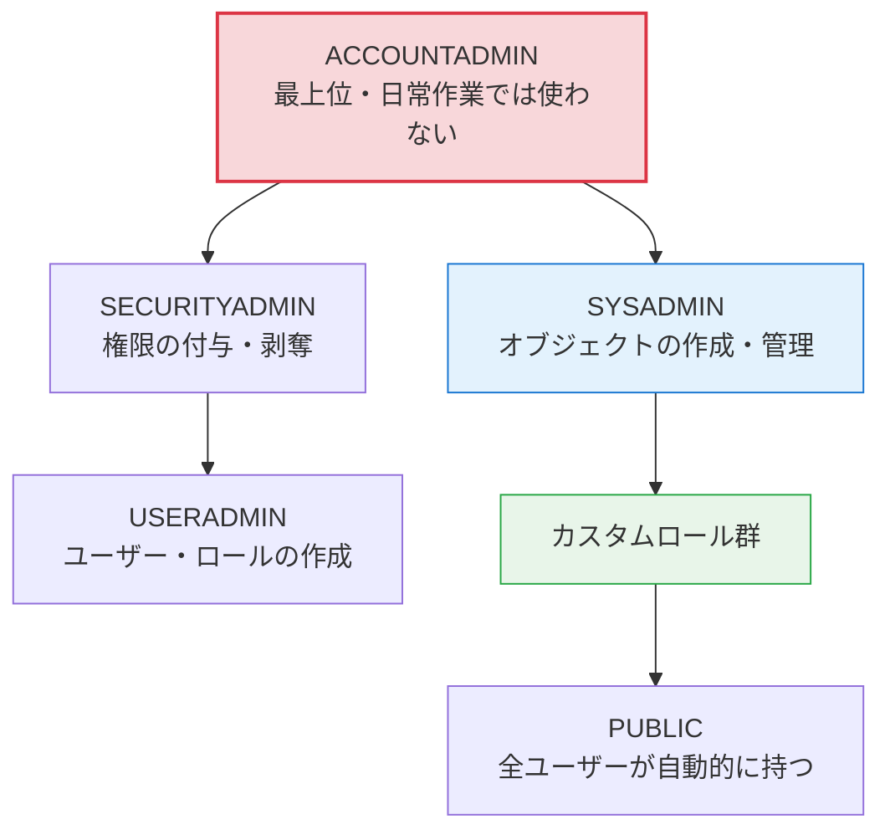
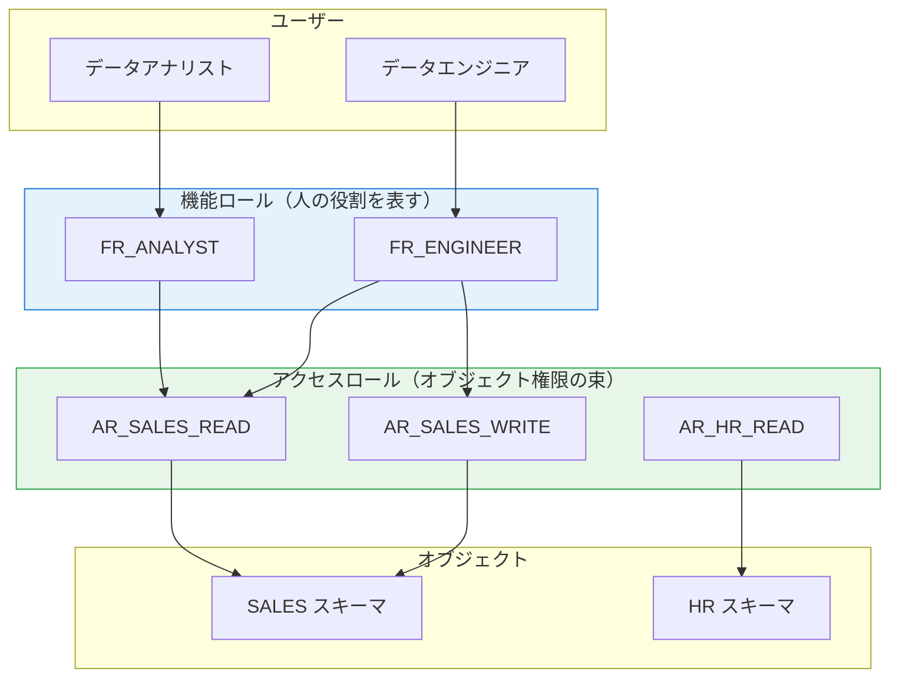
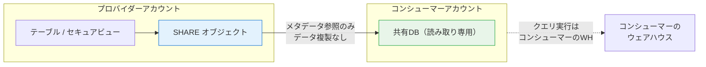
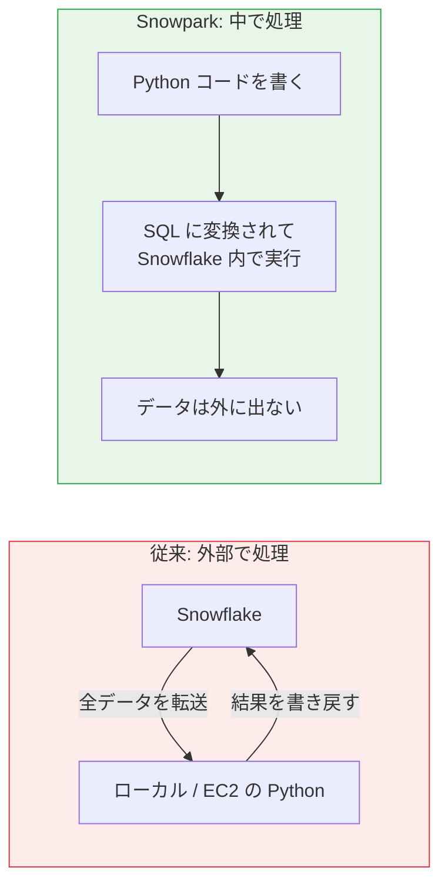
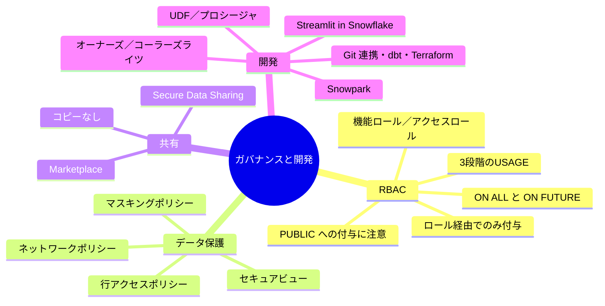

# 03 Snowflake ガバナンス＆開発編

> **この巻で分かること**
> - Snowflake の RBAC（ロールベースアクセス制御）の考え方と、実務での設計パターン
> - 列マスキング・行アクセスポリシーによるデータ保護
> - データ共有（Secure Data Sharing）と Marketplace
> - Snowpark（Python）、Streamlit、Notebook、Git 連携
>
> **前提知識**: `01-snowflake-basics.md`（オブジェクト階層）

---

## 1. RBAC の基本 — ここが Snowflake で一番混乱する

### 1.1 大原則

**権限はユーザーではなくロールに付ける。ユーザーにはロールを付ける。**



⚠️ **つまずきポイント: ユーザーに直接 GRANT はできません。** Snowflake ではオブジェクト権限をユーザーに直接付与できません。必ずロールを経由します。

### 1.2 「3 段階の USAGE」

**初学者が最も高確率で踏む罠がこれです。** テーブルを読むには、テーブルへの `SELECT` だけでは足りません。



```sql
-- 最小構成の付与セット
GRANT USAGE  ON WAREHOUSE lab_wh        TO ROLE analyst_role;
GRANT USAGE  ON DATABASE  lab_db        TO ROLE analyst_role;
GRANT USAGE  ON SCHEMA    lab_db.core   TO ROLE analyst_role;
GRANT SELECT ON ALL TABLES IN SCHEMA lab_db.core TO ROLE analyst_role;

-- 「これから作られるテーブル」にも自動で効かせる（FUTURE GRANTS）
GRANT SELECT ON FUTURE TABLES IN SCHEMA lab_db.core TO ROLE analyst_role;
```

💡 **`ON ALL` と `ON FUTURE` の違い**
`ON ALL` は実行時点で存在するオブジェクトにだけ効きます。**明日作られるテーブルには効きません。** 運用では `ON FUTURE` をセットで付けるのが定石です。

❓ **よくある疑問: 「Object does not exist」と言われるが、テーブルは存在する**
権限がない場合、Snowflake は「存在しない」と返します（存在自体を秘匿する設計）。まず `SHOW GRANTS TO ROLE <role>;` で権限を確認してください。

```sql
SHOW GRANTS TO ROLE analyst_role;      -- このロールが持つ権限
SHOW GRANTS ON TABLE lab_db.core.orders; -- このテーブルに対する権限
SHOW GRANTS TO USER tanaka;            -- このユーザーが持つロール
```

### 1.3 システム定義ロール



| ロール | 役割 |
|---|---|
| **ACCOUNTADMIN** | 課金・アカウント設定を含む全権限。**MFA 必須、人数を最小限に、日常操作では使わない** |
| **SYSADMIN** | データベース・ウェアハウスなどオブジェクトの作成・管理 |
| **SECURITYADMIN** | 権限の付与・剥奪、ネットワークポリシー |
| **USERADMIN** | ユーザーとロールの作成 |
| **PUBLIC** | 全ユーザーが自動的に持つ。**ここに GRANT すると全員に公開される** |

⚠️ **`PUBLIC` への付与は事実上「全社公開」です。** Cortex の `SNOWFLAKE.CORTEX_USER` は既定で PUBLIC に付与されているため、本番アカウントでは revoke して専用ロールに絞るのが定石です（→ 04 巻）。

### 1.4 カスタムロールの設計パターン

実務の定石は **「機能ロール（Functional Role）」と「アクセスロール（Access Role）」の 2 層構造**です。



💡 **なぜ 2 層にするのか**
人事異動のたびにオブジェクト権限を張り替えるのは非現実的です。**アクセスロール = 「何にアクセスできるか」、機能ロール = 「どの役割か」**と分けると、異動時は機能ロールの付け替えだけで済みます。

```sql
USE ROLE USERADMIN;
CREATE ROLE IF NOT EXISTS ar_sales_read;
CREATE ROLE IF NOT EXISTS fr_analyst;

USE ROLE SECURITYADMIN;
-- アクセスロールにオブジェクト権限を集約
GRANT USAGE  ON DATABASE lab_db                   TO ROLE ar_sales_read;
GRANT USAGE  ON SCHEMA   lab_db.core              TO ROLE ar_sales_read;
GRANT SELECT ON ALL TABLES IN SCHEMA lab_db.core  TO ROLE ar_sales_read;
GRANT SELECT ON FUTURE TABLES IN SCHEMA lab_db.core TO ROLE ar_sales_read;

-- 機能ロールにアクセスロールを継承させる
GRANT ROLE ar_sales_read TO ROLE fr_analyst;

-- ユーザーには機能ロールだけを付ける
GRANT ROLE fr_analyst TO USER tanaka;

-- 管理性のためカスタムロールは SYSADMIN 配下に置く
GRANT ROLE fr_analyst TO ROLE SYSADMIN;
```

⚠️ **つまずきポイント: 作成者がオーナーになる**
オブジェクトは「作成時に有効だったロール」がオーナーになります。`ACCOUNTADMIN` でうっかりテーブルを作ると、そのテーブルは ACCOUNTADMIN 所有になり、他ロールから触れなくなります。**作業前に必ず `USE ROLE` を確認してください。**

✅ **手を動かす（1章）**

- [ ] カスタムロールを 2 層構造で作成した
- [ ] `SHOW GRANTS TO ROLE` で継承関係を確認した
- [ ] 権限を 1 つ revoke し、「Object does not exist」が出ることを再現した
- [ ] `ON FUTURE` を付けた後に新規テーブルを作り、自動で見えることを確認した

---

## 2. データ保護

### 2.1 動的データマスキング（列単位）

📘 **用語: マスキングポリシー**
列に紐付ける関数で、**参照するロールに応じて値を出し分け**ます。テーブルのデータ自体は変わりません。

```sql
USE ROLE ACCOUNTADMIN;

CREATE OR REPLACE MASKING POLICY mask_email AS (val STRING) RETURNS STRING ->
  CASE
    WHEN CURRENT_ROLE() IN ('FR_PII_VIEWER') THEN val
    WHEN val IS NULL THEN NULL
    ELSE REGEXP_REPLACE(val, '^[^@]+', '****')     -- ****@example.com
  END;

ALTER TABLE customers MODIFY COLUMN email SET MASKING POLICY mask_email;

-- 適用状況の確認
SELECT * FROM TABLE(INFORMATION_SCHEMA.POLICY_REFERENCES(POLICY_NAME => 'mask_email'));
```

### 2.2 行アクセスポリシー（行単位）

「営業担当は自分の地域の行だけ見える」といった制御です。

```sql
-- 誰がどの地域を見られるかのマッピング表
CREATE OR REPLACE TABLE region_access (role_name STRING, region STRING);
INSERT INTO region_access VALUES ('FR_SALES_TOKYO','東京'), ('FR_SALES_OSAKA','大阪');

CREATE OR REPLACE ROW ACCESS POLICY rap_region AS (region STRING) RETURNS BOOLEAN ->
  CURRENT_ROLE() = 'ACCOUNTADMIN'
  OR EXISTS (
    SELECT 1 FROM region_access ra
    WHERE ra.role_name = CURRENT_ROLE() AND ra.region = region
  );

ALTER TABLE orders ADD ROW ACCESS POLICY rap_region ON (region);
```

🏢 **実務メモ**: 行アクセスポリシーは **Cortex Analyst / Agents にもそのまま効きます**。生成された SQL は呼び出しユーザーのロールで実行されるためです。逆に言えば、04 巻で扱う「UDF 経由の階層型エージェント」ではこの前提が崩れます（PAT 所有者の権限で動くため）。ここが設計上の分岐点になります。

### 2.3 セキュアビュー

```sql
CREATE OR REPLACE SECURE VIEW v_orders_masked AS
SELECT order_id, order_date, region, amount FROM orders;
```

💡 **通常のビューとの違い**: 通常のビューは定義（SQL）とクエリプランが利用者に見えます。**セキュアビューはそれを隠し、内部最適化による情報漏えい（行数の推測など）も防ぎます。** 外部組織にデータ共有する場合は必須です。

### 2.4 その他のセキュリティ機能

| 機能 | 概要 |
|---|---|
| **ネットワークポリシー** | 接続元 IP を制限 |
| **MFA / SSO（SAML）** | 認証強化。ACCOUNTADMIN には MFA 必須 |
| **キーペア認証** | サービスアカウント向け。パスワードレス |
| **PAT（Personal Access Token）** | プログラムアクセス用トークン。**有効期限管理が必要** |
| **タグベースのポリシー** | タグを付けた列に自動でマスキングを適用 |
| **Snowflake Horizon** | ガバナンス機能群の総称（分類・系譜・監視） |

```sql
-- ネットワークポリシーの例
CREATE NETWORK POLICY corp_only
  ALLOWED_IP_LIST = ('203.0.113.0/24');
ALTER ACCOUNT SET NETWORK_POLICY = corp_only;
```

---

## 3. データ共有と Marketplace

### 3.1 Secure Data Sharing

📘 **用語: Secure Data Sharing**
**データをコピーせずに**、別の Snowflake アカウントにデータを読み取り専用で見せる仕組み。



💡 **課金の分担**: ストレージ費用は**プロバイダー**、クエリの計算費用は**コンシューマー**が負担します。共有そのものにコピー費用は発生しません。

```sql
-- プロバイダー側
CREATE SHARE sales_share;
GRANT USAGE  ON DATABASE lab_db                 TO SHARE sales_share;
GRANT USAGE  ON SCHEMA   lab_db.core            TO SHARE sales_share;
GRANT SELECT ON VIEW     lab_db.core.v_orders_masked TO SHARE sales_share;
ALTER SHARE sales_share ADD ACCOUNTS = <consumer_account>;

-- コンシューマー側
CREATE DATABASE shared_sales FROM SHARE <provider_account>.sales_share;
```

⚠️ **つまずきポイント**: 共有できるのは**セキュアビュー・テーブル・セキュア UDF**などに限られます。通常のビューは共有できません。また、**リージョンをまたぐ共有にはレプリケーションが必要**です。

### 3.2 Marketplace

Snowsight の **Data » Marketplace** から、天候・人口統計・企業情報などのデータセットを即座に取得できます。多くは無料で、取得すると自分のアカウントにデータベースとして現れます。

🏢 **実務メモ**: 分析の初期段階で「祝日カレンダー」「郵便番号マスタ」「為替レート」などを Marketplace から取ると、内製の手間が省けます。PoC のスピードが上がる定番テクニックです。

---

## 4. 開発機能

### 4.1 Snowpark（Python）

📘 **用語: Snowpark**
Python / Java / Scala のコードを **Snowflake の中で実行**する仕組み。データを外に出さずに処理できます。



```python
from snowflake.snowpark import Session
from snowflake.snowpark.functions import col, sum as sum_

session = Session.builder.configs({
    "account": "<account>", "user": "<user>", "authenticator": "externalbrowser",
    "role": "LAB_ROLE", "warehouse": "LAB_WH",
    "database": "LAB_DB", "schema": "CORE",
}).create()

df = (session.table("ORDERS_RAW")
        .filter(col("ORDER_DATE") >= "2026-01-01")
        .group_by("CUSTOMER_ID")
        .agg(sum_("AMOUNT").alias("TOTAL")))

df.show()                    # 実行される（遅延評価）
df.write.save_as_table("CUSTOMER_TOTALS", mode="overwrite")
```

💡 **遅延評価**: Snowpark の DataFrame 操作は、`show()` や `collect()` を呼ぶまで実行されません。裏で 1 本の SQL に変換されるため、**pandas のように中間結果がメモリに乗ることがありません**。

⚠️ **pandas との使い分け**: `to_pandas()` を呼ぶと全データがクライアントに転送されます。大きなデータでやると破綻します。**集計してから `to_pandas()`** が鉄則です。

### 4.2 UDF とストアドプロシージャ

| | UDF | ストアドプロシージャ |
|---|---|---|
| 目的 | 値を返す関数。SQL の中で使う | 手続き。処理の流れを書く |
| SQL 内での使用 | `SELECT my_udf(col) FROM t` | `CALL my_proc()` |
| DML の実行 | 不可 | 可 |

```sql
-- Python UDF
CREATE OR REPLACE FUNCTION normalize_phone(p STRING)
RETURNS STRING LANGUAGE PYTHON RUNTIME_VERSION = '3.11' HANDLER = 'run'
AS $$
import re
def run(p):
    if p is None: return None
    return re.sub(r'[^0-9]', '', p)
$$;

SELECT normalize_phone('090-1234-5678');   -- 09012345678

-- ストアドプロシージャ（Snowflake Scripting）
CREATE OR REPLACE PROCEDURE refresh_summary()
RETURNS STRING LANGUAGE SQL
AS
$$
BEGIN
  DELETE FROM daily_summary;
  INSERT INTO daily_summary SELECT order_date, SUM(amount) FROM orders_raw GROUP BY 1;
  RETURN 'done: ' || (SELECT COUNT(*) FROM daily_summary) || ' rows';
END;
$$;

CALL refresh_summary();
```

📘 **用語: オーナーズライツ / コーラーズライツ**
プロシージャの既定は**オーナーズライツ**（作成者の権限で動く）。呼び出したユーザーの権限で動かしたい場合は `EXECUTE AS CALLER` を指定します。**セキュリティ設計で必ず論点になります。**

```sql
CREATE OR REPLACE PROCEDURE p() RETURNS STRING LANGUAGE SQL
EXECUTE AS CALLER
AS $$ BEGIN RETURN CURRENT_ROLE(); END; $$;
```

### 4.3 Streamlit in Snowflake（SiS）

Python で書いたデータアプリを Snowflake 内でホストできます。URL を共有するだけで社内に配布でき、権限は Snowflake の RBAC がそのまま効きます。

```python
import streamlit as st
from snowflake.snowpark.context import get_active_session

session = get_active_session()
st.title("売上ダッシュボード")

region = st.selectbox("地域", ["東京", "大阪", "名古屋"])
df = session.sql(f"""
    SELECT order_date, SUM(amount) AS total
    FROM orders_raw WHERE region = '{region}'
    GROUP BY 1 ORDER BY 1
""").to_pandas()

st.line_chart(df.set_index("ORDER_DATE"))
```

⚠️ **04 巻に関わる重要な制約**: Streamlit in Snowflake の**ウェアハウスランタイムからは Cortex Agents API を呼べません**。エージェントを組み込んだアプリを作る場合は、**コンテナランタイム**を選択する必要があります。

### 4.4 Notebooks

Snowsight 上で SQL セルと Python セルを混在させて書けるノートブック環境です。Snowpark・Cortex 系の検証に最適です。

### 4.5 Git 連携

```sql
CREATE OR REPLACE SECRET github_secret
  TYPE = PASSWORD USERNAME = '<user>' PASSWORD = '<personal_access_token>';

CREATE OR REPLACE API INTEGRATION github_api
  API_PROVIDER = git_https_api
  API_ALLOWED_PREFIXES = ('https://github.com/<org>/')
  ALLOWED_AUTHENTICATION_SECRETS = (github_secret)
  ENABLED = TRUE;

CREATE OR REPLACE GIT REPOSITORY my_repo
  API_INTEGRATION = github_api
  GIT_CREDENTIALS = github_secret
  ORIGIN = 'https://github.com/<org>/<repo>.git';

ALTER GIT REPOSITORY my_repo FETCH;
LS @my_repo/branches/main;
EXECUTE IMMEDIATE FROM @my_repo/branches/main/sql/deploy.sql;
```

🏢 **実務メモ: CI/CD**
Snowflake のオブジェクト定義をコード管理する方法は主に 3 つです。

| 手段 | 特徴 |
|---|---|
| **schemachange** | SQL ファイルのバージョン管理。軽量、導入が容易 |
| **dbt** | 変換ロジックの管理に強い。テスト・系譜・ドキュメントが付く |
| **Terraform（Snowflake Provider）** | ロール・ウェアハウスなどインフラ寄りの管理に強い |

実務では **dbt（変換）＋ Terraform（権限・基盤）** の組み合わせが多く見られます。

---

## 5. この巻のまとめ



### 理解度チェック

- [ ] テーブルを読むのに必要な 4 つの権限を列挙できる
- [ ] `ON ALL` と `ON FUTURE` の違いを説明できる
- [ ] 機能ロールとアクセスロールを分ける理由を説明できる
- [ ] マスキングポリシーと行アクセスポリシーの適用単位の違いを言える
- [ ] オーナーズライツとコーラーズライツの違いが、Cortex の設計にどう影響するか説明できる
- [ ] Snowpark で `to_pandas()` を使うときの注意点を言える

**次は → `04-snowflake-cortex.md`**
