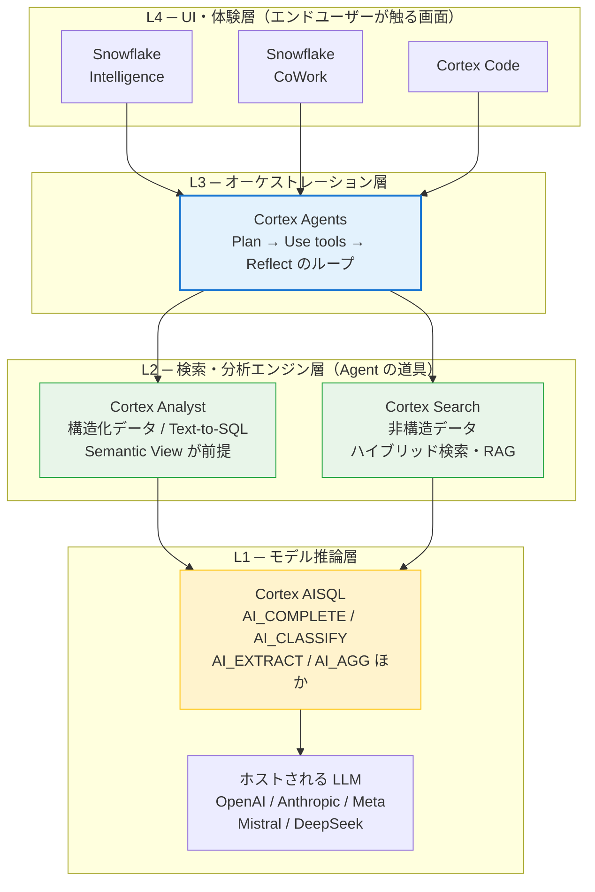
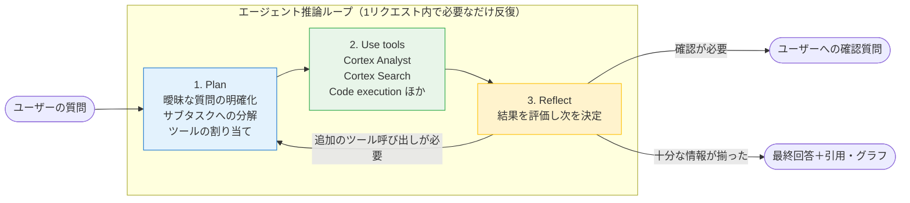
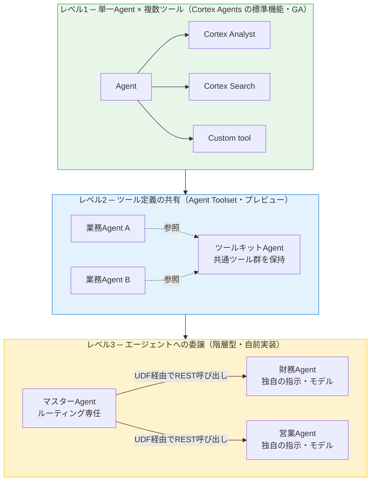
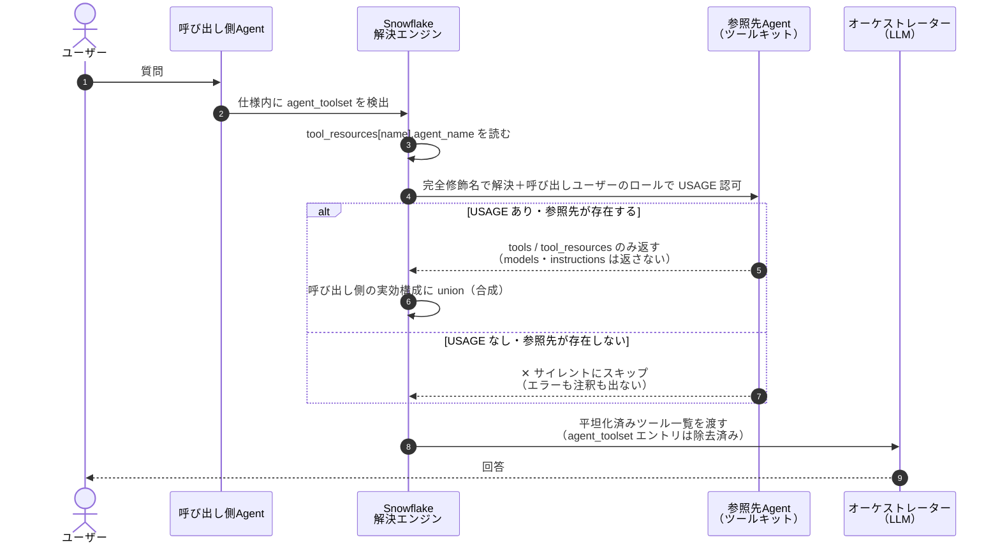
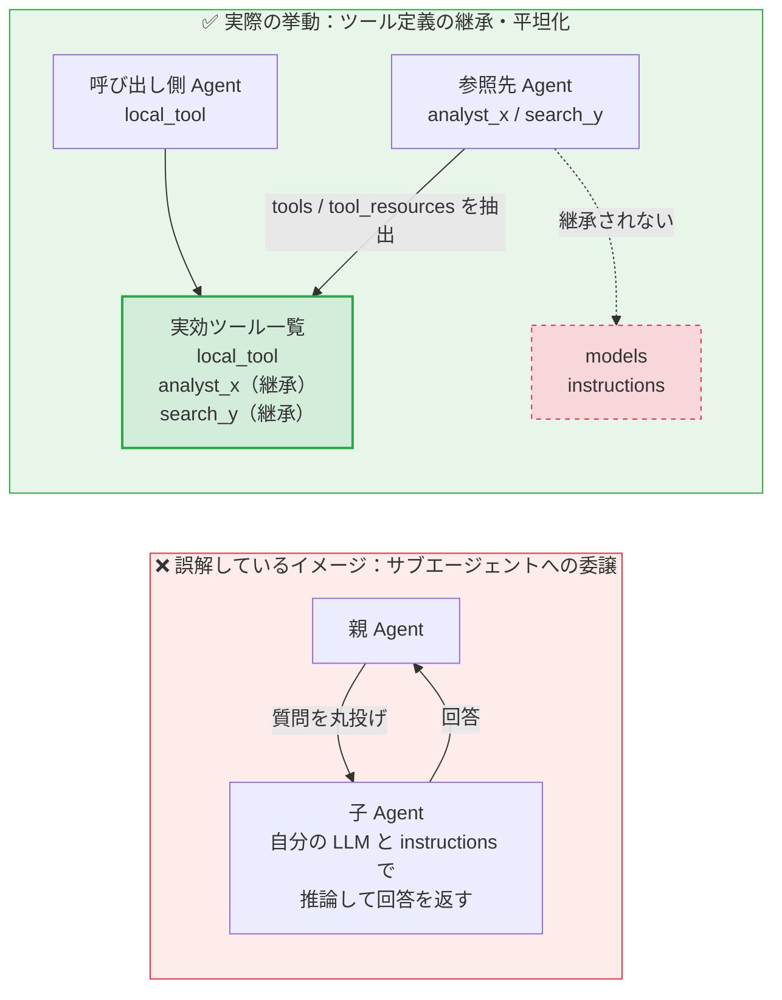
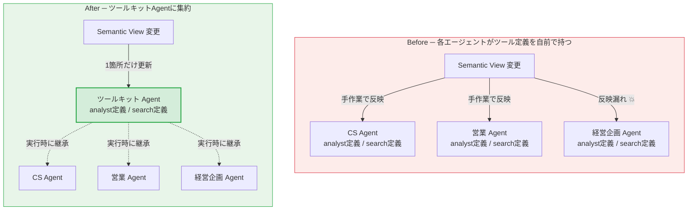
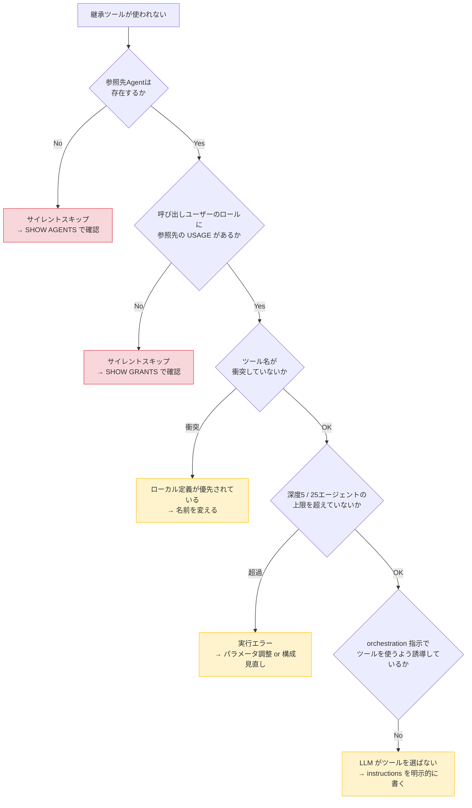
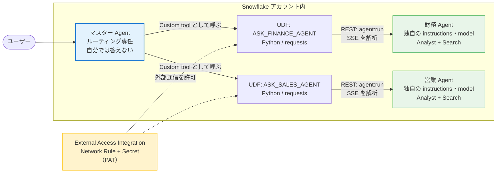
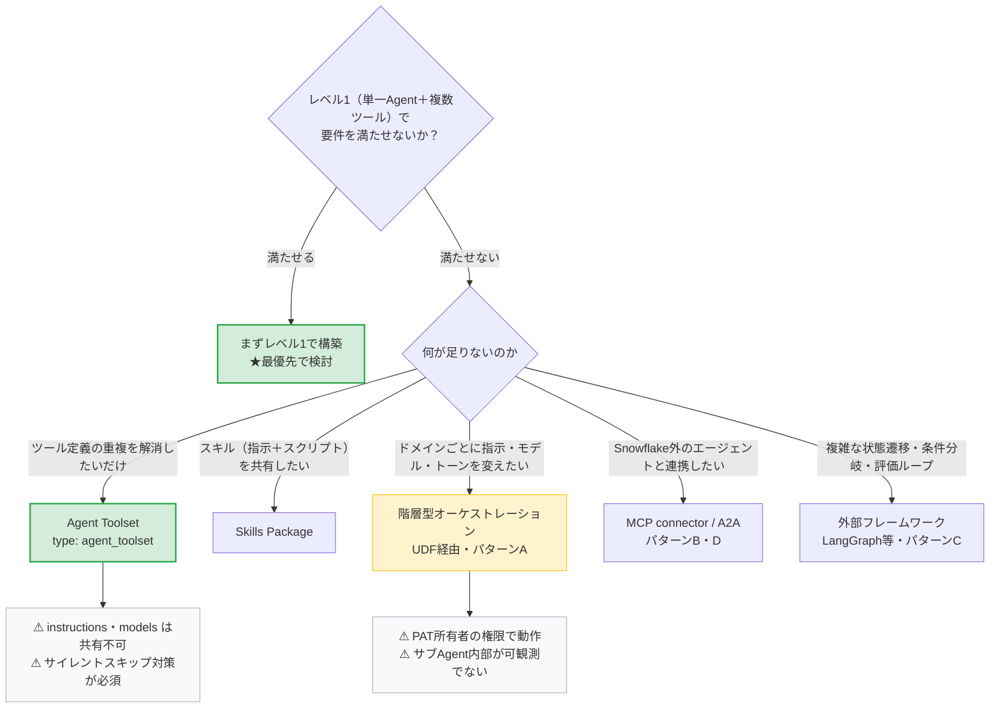

# Snowflake Cortex 実務学習ガイド
### AISQL / Cortex Search / Cortex Analyst / Cortex Agents / マルチエージェント（Agent Toolset）

> 作成日: 2026-08-04
> 出典: Snowflake 公式ドキュメント（docs.snowflake.com）および Snowflake 公式ブログ
> 想定読者: Snowflake を触り始めた段階で、AI/分析活用（Cortex 系）を実務で担当するエンジニア

---

## 0. このドキュメントの使い方

読むだけでは身に付かない構成にしてあります。各章の末尾に **「手を動かすチェックリスト」** があるので、トライアルアカウントで実際に実行しながら進めてください。

| 章 | 内容 | 想定所要 |
|---|---|---|
| 1 | 全体像とレイヤ構造 | 20分 |
| 2 | 事前準備（権限・リージョン） | 30分 |
| 3 | Cortex AISQL（SQL から LLM を呼ぶ） | 1.5時間 |
| 4 | Cortex Search（非構造データ / RAG） | 2時間 |
| 5 | Cortex Analyst（構造化データ / Text-to-SQL） | 3時間 |
| 6 | Cortex Agents（エージェント基盤） | 3時間 |
| 7 | **マルチエージェント（Agent Toolset / 階層型オーケストレーション）** | 4時間 |
| 8 | コスト・運用・監視 | 1時間 |
| 9 | 学習ロードマップ | — |

---

## 1. 全体像 — Cortex は「1つの機能」ではなくレイヤ構造

初学者が最初につまずくのは「Cortex ＝ 何を指すのか」が曖昧な点です。Cortex は Snowflake の AI 機能群の総称であり、**下から積み上がる 4 層**として理解すると整理できます。



### 各レイヤの責務

| レイヤ | 機能名 | 何をするか | 入力 | 出力 |
|---|---|---|---|---|
| L1 | Cortex AISQL | SQL 関数として LLM 推論を実行 | テキスト/画像/音声/ドキュメント | 列の値 |
| L2 | Cortex Analyst | 自然言語 → SQL 生成（Semantic View 前提） | 質問文 | SQL + 実行結果 |
| L2 | Cortex Search | ベクトル＋キーワードのハイブリッド検索 | クエリ文字列 | 関連ドキュメント |
| L3 | Cortex Agents | 質問を分解しツールを選択・実行・再考 | 質問文 + ツール定義 | 最終回答（+ 引用/グラフ） |
| L4 | Snowflake Intelligence / CoWork | 上記をノーコードで使うチャット UI | — | — |

### 実務上の判断軸（重要）

| やりたいこと | 使うべきもの |
|---|---|
| 数百万行のレビューを一括で感情分析したい | **AISQL**（バッチ処理向けに最適化） |
| 社内規程 PDF を検索して回答させたい | **Cortex Search** |
| 「先月の東京の売上は？」に SQL 無しで答えたい | **Cortex Analyst**（＋Semantic View） |
| 構造化＋非構造化をまたいだ複合質問に答えたい | **Cortex Agents** |
| 低レイテンシの対話 | REST API（Complete / Embed / Agents API） |
| 高スループットのバッチ | AISQL の SQL 関数 |

> **設計上の注意**: 公式ドキュメントは AISQL について「多数の入力を処理するバッチ処理に適しており、レイテンシが重要な対話用途では REST API を使う」ことを明記しています。UI から 1 件ずつ AISQL を呼ぶ設計はアンチパターンです。

---

## 2. 事前準備

### 2.1 必要なロール / 権限

| 対象 | 必要な権限 |
|---|---|
| AISQL 関数 | アカウントレベル権限 `USE AI FUNCTIONS` ＋ DB ロール `SNOWFLAKE.CORTEX_USER` または `SNOWFLAKE.AI_FUNCTIONS_USER` |
| Cortex Analyst | `SNOWFLAKE.CORTEX_USER` または `SNOWFLAKE.CORTEX_ANALYST_USER`。加えてステージへの READ、Semantic View 内のテーブルへの SELECT |
| Cortex Search（作成） | `SNOWFLAKE.CORTEX_USER` または `SNOWFLAKE.CORTEX_EMBED_USER`、スキーマへの `CREATE CORTEX SEARCH SERVICE`、ソーステーブルへの SELECT、ウェアハウスへの USAGE |
| Cortex Search（利用） | サービス／DB／スキーマへの USAGE |
| Cortex Agents | `SNOWFLAKE.CORTEX_USER` または `SNOWFLAKE.CORTEX_AGENT_USER`、Agent オブジェクトへの権限、各ツールが使うオブジェクトへの権限 |

```sql
-- 学習用ロールのセットアップ例
USE ROLE ACCOUNTADMIN;

CREATE ROLE IF NOT EXISTS cortex_lab_role;
GRANT DATABASE ROLE SNOWFLAKE.CORTEX_USER TO ROLE cortex_lab_role;
GRANT ROLE cortex_lab_role TO USER <your_user>;

CREATE DATABASE IF NOT EXISTS cortex_lab;
CREATE SCHEMA  IF NOT EXISTS cortex_lab.core;
CREATE WAREHOUSE IF NOT EXISTS cortex_lab_wh WITH WAREHOUSE_SIZE = 'X-SMALL' AUTO_SUSPEND = 60;

GRANT USAGE ON DATABASE cortex_lab TO ROLE cortex_lab_role;
GRANT USAGE ON SCHEMA cortex_lab.core TO ROLE cortex_lab_role;
GRANT USAGE ON WAREHOUSE cortex_lab_wh TO ROLE cortex_lab_role;
GRANT CREATE CORTEX SEARCH SERVICE ON SCHEMA cortex_lab.core TO ROLE cortex_lab_role;
GRANT CREATE SEMANTIC VIEW        ON SCHEMA cortex_lab.core TO ROLE cortex_lab_role;
```

> `CORTEX_USER` はデフォルトで `PUBLIC` に付与されています。本番では PUBLIC から revoke し、専用ロールに絞るのが定石です。

### 2.2 リージョンの壁（実務で必ず踏む）

機能によって利用可能リージョンが異なります。日本リージョン（AWS 東京 / Azure Japan East）で全部が動くとは限りません。

- **Cortex Analyst** がネイティブ提供されるのは AWS ap-northeast-1（東京）、AWS us-east-1 / us-west-2、AWS eu-central-1 / eu-west-1、AWS ap-southeast-2、Azure East US 2、Azure West Europe など。
- 対象外リージョンでも **クロスリージョン推論（Cross-region inference）** を有効にすれば利用可能。ただしリクエストが他リージョンで処理されるため、**データレジデンシー要件があるプロジェクトでは事前にクライアント合意が必要**。
- Cortex Search は上記より広いリージョンで利用可能だが、埋め込みモデルごとに可否が異なる（例: `voyage-multilingual-2` は東京では可、Azure Japan East では不可）。

```sql
-- クロスリージョン推論の設定（ACCOUNTADMIN）
ALTER ACCOUNT SET CORTEX_ENABLED_CROSS_REGION = 'ANY_REGION';  -- または 'AWS_US' 等
```

### ✅ 手を動かすチェックリスト（2章）

- [ ] 学習用 DB / スキーマ / ウェアハウス / ロールを作成した
- [ ] `SELECT SNOWFLAKE.CORTEX.COUNT_TOKENS('snowflake-arctic-embed-m','test');` が通る
- [ ] 自アカウントのリージョンを確認し、Analyst がネイティブ提供かクロスリージョンが必要かを判定した

---

## 3. Cortex AISQL — SQL から LLM を呼ぶ

### 3.1 主要関数

`AI_COMPLETE` を中心に、タスク特化型の関数群が用意されています。

| 関数 | 用途 |
|---|---|
| `AI_COMPLETE` | 汎用の生成タスク。テキスト/画像を入力に補完を生成。迷ったらこれ |
| `AI_CLASSIFY` | ユーザー定義カテゴリへの分類（テキスト/画像） |
| `AI_FILTER` | True/False を返す。`WHERE` や `JOIN … ON` に直接書ける |
| `AI_AGG` | 複数行を集約してプロンプトに基づく洞察を返す（コンテキスト長制限を受けない） |
| `AI_SUMMARIZE_AGG` | 複数行を集約して要約（同上） |
| `AI_EXTRACT` | テキスト/画像/ドキュメントから構造化情報を抽出。多言語対応 |
| `AI_SENTIMENT` | 感情抽出 |
| `AI_EMBED` | 埋め込みベクトル生成 |
| `AI_SIMILARITY` | 2 入力間の類似度 |
| `AI_PARSE_DOCUMENT` | ステージ上のドキュメントから OCR / レイアウト付きテキストを抽出 |
| `AI_TRANSCRIBE` | ステージ上の音声/動画を文字起こし（タイムスタンプ・話者付き） |
| `AI_REDACT` | PII のマスキング |
| `AI_TRANSLATE` | 翻訳 |

補助関数: `TO_FILE`（ステージ上ファイルの参照生成）、`AI_COUNT_TOKENS`（トークン数計算）、`PROMPT`（プロンプトオブジェクト構築）。

> **移行メモ**: 旧 `SNOWFLAKE.CORTEX.COMPLETE` は後方互換のために残っていますが、**2026年末までに非推奨化**予定と明記されています。新規実装は `AI_COMPLETE` を使ってください。

### 3.2 ハンズオン

```sql
USE ROLE cortex_lab_role;
USE SCHEMA cortex_lab.core;
USE WAREHOUSE cortex_lab_wh;

-- サンプルデータ
CREATE OR REPLACE TABLE reviews (
  review_id   NUMBER,
  product     VARCHAR,
  body        VARCHAR
);

INSERT INTO reviews VALUES
  (1,'ルーター','届いた翌日に電源が入らなくなった。交換対応をお願いしたい。'),
  (2,'ルーター','設定が簡単で電波も安定している。価格を考えれば満足。'),
  (3,'モデム'  ,'説明書が分かりにくい。サポートに問い合わせたら丁寧に対応してもらえた。');

-- ① 単純な生成
SELECT AI_COMPLETE('claude-4-sonnet',
  '次のレビューを20字以内で要約: ' || body) AS summary
FROM reviews;

-- ② 分類（カテゴリを明示）
SELECT
  review_id,
  AI_CLASSIFY(body, ['故障・不具合','使い勝手','サポート対応','価格']) AS category
FROM reviews;

-- ③ 感情
SELECT review_id, AI_SENTIMENT(body) AS sentiment FROM reviews;

-- ④ AI_FILTER を WHERE 句に直接埋め込む（SQL ネイティブ統合の真骨頂）
SELECT review_id, body
FROM reviews
WHERE AI_FILTER('このレビューは製品の不具合を報告しているか？: ' || body);

-- ⑤ 複数行をまたいだ集約洞察（コンテキスト長を気にしなくてよい）
SELECT AI_AGG(body, '製品改善のために優先すべき課題を3点、箇条書きで日本語で挙げてください')
FROM reviews;
```

### 3.3 実務上の注意

1. **モデル選択がコストを支配する。** トークン課金であり、出力トークンも課金対象。分類・抽出のような定型処理に大型モデルを使うのは無駄です。
2. **モデルのアカウント制御。** `CORTEX_MODELS_ALLOWLIST` パラメータでアカウント全体の利用可能モデルを制御できます（アカウントレベルのみ設定可）。規制要件がある案件では必須の検討事項。
3. **バッチ前提の設計。** 大量行に対する `AI_*` 関数はウェアハウスサイズと並列度に強く影響されます。まず 100 行で試算 → 全件、という手順を守ること。

### ✅ 手を動かすチェックリスト（3章）

- [ ] 上記 ①〜⑤ を全て実行した
- [ ] `AI_COUNT_TOKENS` で入力トークン数を確認した
- [ ] `SNOWFLAKE.ACCOUNT_USAGE` 系ビューで自分の消費クレジットを確認した

---

## 4. Cortex Search — 非構造データの検索基盤

### 4.1 何をしてくれるか

埋め込み生成・インフラ管理・検索品質チューニング・インデックス更新を意識せずに、テキストデータ上にハイブリッド検索エンジンを構築できるマネージドサービスです。内部では以下を組み合わせています。

- **ベクトル検索**（意味的に近い文書の取得）
- **キーワード検索**（字面が近い文書の取得）
- **セマンティック再ランキング**（結果セットの並び替え）

主な用途は 3 つ。**RAG のリトリーバル層**、**エンタープライズ検索のバックエンド**、そして **Cortex Agents の非構造データ用ツール** です。

### 4.2 ハンズオン

```sql
CREATE OR REPLACE TABLE support_docs (
  doc_id    VARCHAR,
  title     VARCHAR,
  body      VARCHAR,
  category  VARCHAR
);

INSERT INTO support_docs VALUES
  ('D001','返品ポリシー','商品到着後14日以内であれば返品を受け付けます。開封済みの場合は…','policy'),
  ('D002','初期設定ガイド','ルーターの電源を入れ、LEDが緑色に点灯するまで待ちます。次に…','guide'),
  ('D003','保証規定','購入日から1年間、通常使用における故障を無償で修理します。','policy');

-- 検索サービスの作成
CREATE OR REPLACE CORTEX SEARCH SERVICE support_docs_svc
  ON body                                   -- 検索対象列
  ATTRIBUTES category                       -- フィルタに使う列
  WAREHOUSE = cortex_lab_wh
  TARGET_LAG = '1 hour'
  EMBEDDING_MODEL = 'snowflake-arctic-embed-l-v2.0'  -- 日本語なら多言語モデルを選ぶ
  AS (
    SELECT doc_id, title, body, category FROM support_docs
  );

-- 動作確認（SEARCH_PREVIEW）
SELECT PARSE_JSON(
  SNOWFLAKE.CORTEX.SEARCH_PREVIEW(
    'cortex_lab.core.support_docs_svc',
    '{
       "query": "返品したい",
       "columns": ["doc_id","title","body"],
       "filter": {"@eq": {"category": "policy"}},
       "limit": 2
     }'
  )
)['results'] AS results;
```

### 4.3 設計上の重要ポイント

| 論点 | 内容 |
|---|---|
| **埋め込みモデル選定** | デフォルトは `snowflake-arctic-embed-m-v1.5`（**英語専用**）。日本語データでは `snowflake-arctic-embed-l-v2.0`（多言語, 512トークン）または `-8k`（8000トークン）を必ず明示指定する |
| **チャンクサイズ** | 公式推奨は **512トークン以下**。長文コンテキストモデルがあっても、小さいチャンクの方が検索精度・下流 LLM 品質ともに高いという研究結果が示されている。`SPLIT_TEXT_RECURSIVE_CHARACTER` を使う |
| **リフレッシュ** | Dynamic Table と同じ増分リフレッシュ制約に従う。ソースクエリが増分リフレッシュ対象外だとサービス作成に失敗する |
| **PRIMARY KEY** | 指定すると変更行だけを再埋め込みする最適化パスが使える。コスト・レイテンシに直結するので**実務では原則指定** |
| **オーナー権限で実行** | 検索はオーナーズライツで動く。検索サービスへの USAGE を持つロールは、元テーブルへの SELECT が無くても検索結果を見られる。**RBAC 設計時の落とし穴** |
| **AUTO_SUSPEND** | 無操作時にサービングを自動停止できる（最小 1800 秒）。検証環境のコスト削減に有効 |
| **上限** | マテリアライズ結果 400M 行、単一サービス 20 QPS / アカウント全体 140 QPS |

### ✅ 手を動かすチェックリスト（4章）

- [ ] 日本語データで多言語埋め込みモデルを指定してサービスを作成した
- [ ] `SEARCH_PREVIEW` でフィルタ付き検索が返ることを確認した
- [ ] `DESCRIBE CORTEX SEARCH SERVICE` で `INDEXING_STATE` / `SERVING_STATE` を確認した

---

## 5. Cortex Analyst — 構造化データの Text-to-SQL

### 5.1 位置づけ

自然言語のビジネス質問に対して SQL を生成し、Snowflake 上で実行するフルマネージドサービスです。REST API 中心の設計になっており、Streamlit / Slack / Teams / 自社アプリなどに組み込めます。

重要な特徴:

- 実行時に**最適なモデルの組み合わせを自動選択**する（利用者がモデルを直接指定することはできない）
- **顧客データで学習しない**。推論には Semantic View のメタデータ（テーブル名・列名・説明など）のみを使用する
- 生成された SQL は**自アカウントのウェアハウスで実行**され、既存の RBAC がそのまま効く

モデル選択の優先順位は Claude Sonnet 4.6 → Claude Sonnet 4.5 → GPT 4.1 → Arctic Text2SQL R1.5 → Mistral Large 2 と Llama 3.1 70b の組み合わせ、という順で、ロールがアクセスできる最上位モデルが使われます。

### 5.2 Semantic View が精度の 9 割を決める

**ここが Cortex Analyst の本質です。** スキーマ定義だけでは「売上とは何か」「有効顧客とは何か」といったビジネス知識が欠落するため、汎用の Text-to-SQL は精度が出ません。Semantic View がその橋渡しをします。

| 構成要素 | 意味 | 例 |
|---|---|---|
| **Logical table** | ビジネス実体 | orders, customers |
| **Relationship** | 結合パス | orders → customers |
| **Fact** | 行レベルの数量 | 割引後金額 |
| **Dimension** | カテゴリ軸 | 顧客名、受注年 |
| **Metric** | 集計 KPI | 平均受注額 |

> 旧来のステージ上 YAML ファイル（Semantic Model）は後方互換で残っていますが、**新規実装は Semantic View（スキーマレベルのオブジェクト）が推奨**です。RBAC・共有・派生メトリクスなどがネイティブに使えます。

### 5.3 ハンズオン（TPC-H サンプルデータ）

```sql
CREATE OR REPLACE SEMANTIC VIEW cortex_lab.core.sales_sv

  TABLES (
    orders AS SNOWFLAKE_SAMPLE_DATA.TPCH_SF1.ORDERS
      PRIMARY KEY (o_orderkey)
      WITH SYNONYMS ('受注', '注文')
      COMMENT = '受注ヘッダ',
    customers AS SNOWFLAKE_SAMPLE_DATA.TPCH_SF1.CUSTOMER
      PRIMARY KEY (c_custkey)
      COMMENT = '顧客マスタ',
    line_items AS SNOWFLAKE_SAMPLE_DATA.TPCH_SF1.LINEITEM
      PRIMARY KEY (l_orderkey, l_linenumber)
      COMMENT = '受注明細'
  )

  RELATIONSHIPS (
    orders_to_customers AS orders (o_custkey)   REFERENCES customers,
    lines_to_orders     AS line_items (l_orderkey) REFERENCES orders
  )

  FACTS (
    line_items.net_price AS l_extendedprice * (1 - l_discount)
      COMMENT = '割引適用後の明細金額'
  )

  DIMENSIONS (
    customers.customer_name AS customers.c_name
      WITH SYNONYMS = ('顧客名')
      COMMENT = '顧客名',
    orders.order_date AS o_orderdate
      COMMENT = '受注日',
    orders.order_year AS YEAR(o_orderdate)
      COMMENT = '受注年',
    orders.market_segment AS customers.c_mktsegment
      COMMENT = '市場セグメント'
      SAMPLE_VALUES ('BUILDING','AUTOMOBILE','MACHINERY','HOUSEHOLD','FURNITURE')
      IS_ENUM
  )

  METRICS (
    orders.order_count     AS COUNT(o_orderkey)   COMMENT = '受注件数',
    orders.avg_order_value AS AVG(o_totalprice)   COMMENT = '平均受注金額',
    line_items.total_sales AS SUM(line_items.net_price) COMMENT = '売上高（割引後）'
  )

  COMMENT = '売上分析用セマンティックビュー'

  AI_SQL_GENERATION '金額は小数点2桁に丸めること。日付は YYYY-MM-DD 形式で返すこと。'
  AI_QUESTION_CATEGORIZATION '個人情報に関する質問は回答せず、管理者への問い合わせを促すこと。';
```

作成後は SQL から直接検証できます。

```sql
SELECT * FROM SEMANTIC_VIEW(
  cortex_lab.core.sales_sv
  METRICS    line_items.total_sales, orders.order_count
  DIMENSIONS orders.order_year, orders.market_segment
) ORDER BY 1, 2;
```

### 5.4 精度を上げる 4 つのレバー（重要）

| レバー | 効果 | 記述場所 |
|---|---|---|
| `COMMENT` / `WITH SYNONYMS` | 列の意味と言い換えを LLM に伝える。**日本語のシノニムを入れると日本語質問の精度が明確に上がる** | 各要素 |
| `SAMPLE_VALUES` / `IS_ENUM` | 取りうる値を提示。`IS_ENUM` を付けるとその値だけでフィルタするようになる | Dimension / Fact |
| `AI_SQL_GENERATION` / `AI_QUESTION_CATEGORIZATION` | SQL 生成方針・質問の受付ポリシーを自然言語で指示 | View 直下 |
| `AI_VERIFIED_QUERIES` | 「この質問にはこの SQL」という検証済みペアを登録。**最も効果が高い** | View 直下 |

```sql
-- 検証済みクエリの登録例
AI_VERIFIED_QUERIES (
  yearly_sales AS (
    QUESTION '年度ごとの売上高を教えて'
    VERIFIED_AT 1785000000
    ONBOARDING_QUESTION TRUE
    VERIFIED_BY '(STEWARD = data_stewards)'
    SQL 'SELECT o.order_year, SUM(li.net_price) AS total_sales
         FROM orders o JOIN line_items li ON li.l_orderkey = o.o_orderkey
         GROUP BY o.order_year ORDER BY o.order_year'
  )
)
```

### 5.5 REST API と マルチターン

```bash
curl -X POST "$SNOWFLAKE_ACCOUNT_BASE_URL/api/v2/cortex/analyst/message" \
  -H "Content-Type: application/json" \
  -H "Authorization: Bearer $PAT" \
  -d '{
    "semantic_view": "cortex_lab.core.sales_sv",
    "messages": [
      {"role":"user","content":[{"type":"text","text":"2023年の市場セグメント別売上は？"}]}
    ]
  }'
```

会話履歴を `messages` にそのまま積むことでフォローアップ質問に対応します（「じゃあ北米は？」→ 直前の文脈を補完して解釈）。

**既知の制限（設計時に必ず考慮）:**

- 前回の SQL の**実行結果**は参照できない（「2番目の商品の売上は？」は答えられない）
- SQL で解けない質問には答えない（「どんな傾向が見える？」のような洞察生成は範囲外）
- ターン数が増えたり意図が頻繁に変わると解釈精度が落ちる → 会話をリセットする UI 設計が必要
- LLM はステートレスなため、**毎ターン全履歴を処理する ＝ ターンが進むほどコストが上がる**

### ✅ 手を動かすチェックリスト（5章）

- [ ] Semantic View を作成し `SEMANTIC_VIEW()` で直接クエリできた
- [ ] `SHOW SEMANTIC METRICS IN <view>` で定義を確認した
- [ ] REST API で自然言語質問を投げ、生成 SQL を確認した
- [ ] シノニム／`SAMPLE_VALUES` を追加して精度が変わることを体感した
- [ ] `CORTEX_ANALYST_USAGE_HISTORY` ビューでメッセージ課金を確認した

---

## 6. Cortex Agents — エージェント基盤

### 6.1 概要

Cortex Agents は、**Snowflake のガバナンス境界内で動くフルマネージドのエージェント基盤**です。オーケストレーションループ・ランタイム・サンドボックスを自前で構築せずに、推論 → 計画 → ツール実行 → 応答生成を行えます。

推論ループは 3 ステップ:

1. **Plan** — 曖昧な質問の明確化、複雑な質問のサブタスク分解、各サブタスクへのツール割り当て
2. **Use tools** — 選択したツールを実行
3. **Reflect and respond** — 結果を評価し、追加質問・別ツール呼び出し・最終回答のいずれかを決定



このループが 1 リクエスト内で必要に応じて繰り返されます。

### 6.2 主要概念

| 概念 | 説明 |
|---|---|
| **Agent** | モデル・ツール・オーケストレーション設定・指示をまとめたスキーマレベルオブジェクト |
| **Tools** | エージェントがデータやシステムに作用する手段 |
| **Orchestration** | Plan → Use tools → Reflect のループ。自然言語の指示で制御する |
| **Thread** | ターンをまたぐ会話コンテキストの永続化。クライアント側で状態管理が不要になる |
| **Run** | `agent:run` API への 1 リクエスト。推論・ツール呼び出し・再考のイベントがストリームされる |

### 6.3 利用できるツール一覧

| ツール | `tool_spec.type` | 説明 |
|---|---|---|
| Cortex Analyst | `cortex_analyst_text_to_sql` | Semantic View 経由の Text-to-SQL |
| Cortex Search | `cortex_search` | 非構造データ検索。フィルタ・取得列・件数などをクエリに応じて動的調整 |
| Analytical search | （Search のオプション） | 大規模文書集合に対する集計・件数・傾向分析。複数インデックスを横断し AISQL を全結果に適用 |
| Code execution | `code_execution` | 隔離サンドボックスで Python 実行 |
| Data to Chart | `data_to_chart` | 他ツールの結果からグラフ生成 |
| Custom tools | `generic` | ストアドプロシージャ / UDF による独自ロジック・外部システム連携 |
| Agent skills | （`skills` セクション） | 指示とスクリプトをパッケージ化した再利用可能な能力 |
| MCP connectors | — | リモート MCP サーバのツール（Jira, Salesforce, 自社アプリ等） |
| **Agent toolsets** | **`agent_toolset`** | **他エージェントのツールを実行時に継承（← 7章で詳述）** |
| Web search | `web_search` | Brave Web Search API による公開 Web 検索。アカウントレベルで有効化が必要 |

### 6.4 ハンズオン — エージェントの作成

```sql
CREATE OR REPLACE AGENT cortex_lab.core.sales_agent
  COMMENT = '売上分析＋社内文書検索エージェント'
  PROFILE = '{"display_name": "売上アシスタント", "color": "blue"}'
  FROM SPECIFICATION
$$
models:
  orchestration: auto        # 推奨。アカウントで利用可能な最高品質モデルが自動選択される

orchestration:
  budget:
    seconds: 60
    tokens: 32000

instructions:
  response: "回答は日本語で、結論を先に述べ、根拠となる数値を必ず添えること。"
  orchestration: |
    売上・件数・金額に関する質問は sales_analyst ツールを使うこと。
    返品・保証・規程に関する質問は policy_search ツールを使うこと。
    数値の比較や推移を示す場合は data_to_chart でグラフ化すること。
  sample_questions:
    - question: "2023年の市場セグメント別売上を教えて"
    - question: "返品はいつまで受け付けていますか？"

tools:
  - tool_spec:
      type: "cortex_analyst_text_to_sql"
      name: "sales_analyst"
      description: "受注・売上・顧客に関する数値をSQLで集計する"
  - tool_spec:
      type: "cortex_search"
      name: "policy_search"
      description: "社内規程・ポリシー文書を検索する"
  - tool_spec:
      type: "data_to_chart"
      name: "data_to_chart"
      description: "データからグラフを生成する"

tool_resources:
  sales_analyst:
    semantic_view: "cortex_lab.core.sales_sv"
    execution_environment:
      type: "warehouse"
      warehouse: "cortex_lab_wh"
      query_timeout: 60
  policy_search:
    name: "cortex_lab.core.support_docs_svc"
    max_results: 5
    title_column: "title"
    id_column: "doc_id"
    columns_and_descriptions:
      body:
        description: "文書の本文"
        type: "string"
        searchable: true
        filterable: false
      category:
        description: "文書区分。policy / guide のいずれか"
        type: "string"
        searchable: false
        filterable: true
$$;
```

確認・更新:

```sql
SHOW AGENTS IN SCHEMA cortex_lab.core;
DESCRIBE AGENT cortex_lab.core.sales_agent;

-- 仕様の更新（LIVE バージョンの差し替え）
ALTER AGENT cortex_lab.core.sales_agent
  MODIFY LIVE VERSION SET SPECIFICATION = $$ ... $$;
```

### 6.5 呼び出し（REST API）

```bash
# ① スレッド作成（会話コンテキストの永続化）
curl -X POST "$SNOWFLAKE_ACCOUNT_BASE_URL/api/v2/cortex/threads" \
  -H "Content-Type: application/json" \
  -H "Authorization: Bearer $PAT" \
  -d '{"origin_application": "my_app"}'
# → thread_id が返る

# ② エージェント実行
curl -X POST "$SNOWFLAKE_ACCOUNT_BASE_URL/api/v2/databases/CORTEX_LAB/schemas/CORE/agents/SALES_AGENT:run" \
  -H "Content-Type: application/json" \
  -H "Authorization: Bearer $PAT" \
  -d '{
    "thread_id": "<thread_id>",
    "parent_message_id": 0,
    "messages": [
      {"role":"user","content":[{"type":"text","text":"2023年の売上上位セグメントとその推移をグラフで"}]}
    ]
  }'
```

- デフォルトは **SSE（Server-Sent Events）ストリーミング**。単一 JSON が欲しい場合は `"stream": false`
- SQL からは `DATA_AGENT_RUN` 関数でも呼べる（非ストリーミング）。ただし公式は **REST API を推奨**
- デフォルトのタイムアウトは 15 分。`"background": true` で最大 6 時間のバックグラウンド実行が可能（スレッド利用が前提）

### 6.6 制限と運用

- **Streamlit in Snowflake（ウェアハウスランタイム）からは Cortex Agents API を呼べない**。SiS から使う場合は **コンテナランタイム**を選択する必要がある（実務でよく踏む制約）
- Agent は**呼び出しユーザーのデフォルトロール**でセッション権限を判定する
- 監視は `Monitor Cortex Agent requests`、品質改善は `Cortex Agent evaluations`（評価データセットを作り、システムメトリクスの推移を Snowsight で追跡）
- **Versioning UI（パブリックプレビュー）** により、LIVE バージョンを本番に据えたまま候補バージョンを検証し、比較・ロールバック・昇格が YAML 手編集なしで行える

### ✅ 手を動かすチェックリスト（6章）

- [ ] Analyst + Search の 2 ツールを持つエージェントを SQL で作成した
- [ ] Snowsight の Agent Playground で構造化・非構造化の両方の質問を投げた
- [ ] REST API + Thread で 2 ターンの会話を成立させた
- [ ] オーケストレーション指示を変更してツール選択が変わることを確認した

---

## 7. マルチエージェント — Agent Toolset と階層型オーケストレーション

> **この章のゴール**
> 1. Snowflake における「マルチエージェント」が指すものを 3 段階に切り分けて理解する
> 2. 2026年7月発表の **Agent Toolset** の正確な挙動（＝ツール継承であって委譲ではない）を説明できる
> 3. Agent Toolset を実際に構築し、落とし穴を自分で再現できる
> 4. 「真の委譲」が必要な場合の階層型オーケストレーションを実装できる
> 5. 案件要件からどのパターンを選ぶべきかを判断できる

---

### 7.1 まず整理 — 「マルチエージェント」には 3 つのレベルがある

この言葉は文脈によって指すものが違うため、議論が噛み合わなくなりがちです。Snowflake の文脈では次の 3 段階に分けて考えると混乱しません。



| レベル | 何が複数か | 実現手段 | 状態 | 難易度 |
|---|---|---|---|---|
| **1** | ツールが複数 | Cortex Agents 標準（`tools` に複数定義） | GA | ★☆☆ |
| **2** | ツール定義の**所有者**が複数 | `agent_toolset` | パブリックプレビュー予定 | ★★☆ |
| **3** | **推論する主体**が複数 | UDF + REST / MCP / 外部フレームワーク | 自前実装 | ★★★ |

> **よくある誤解**: 「Cortex Agents は 1 体で完結するからマルチステップ処理には弱い」——これは誤りです。<br/>
> レベル1の時点で、公式ドキュメントに明記されているとおりエージェントは**複雑な依頼をサブタスクに分解し、各サブタスクに適したツールを選び、結果を評価して次の行動を決める**ループを回します。「複数の LLM に分ける」必要があるのは、**ドメインごとに指示やモデルを変えたい**場合や、**チームごとにエージェントの所有権を分けたい**場合であって、単に処理が多段だからではありません。**まずレベル1で足りないかを検証してから、レベル2・3を検討してください。**

---

### 7.2 2026年7月発表の全体像

2026年7月21日の公式ブログ「Your Agents Are in Production. Now What?」で、Cortex Agents の**運用系機能群**が一括発表されました。全体の位置づけを掴んでおくと、Agent Toolset が単独の機能ではなく「エージェントを組織規模で運用するための一連の施策」の一部であることが分かります。

| 分類 | 機能 | ステータス（発表時点） | 解決する課題 |
|---|---|---|---|
| **Build** | **Agent Toolset** | パブリックプレビュー予定 | ツール定義の重複とドリフト |
| Build | Skills Package | パブリックプレビュー予定 | スキルを 1 オブジェクト化し単一 URI で参照 |
| Build | Tool Search | パブリックプレビュー予定 | 全ツール定義の事前ロードによるコンテキスト圧迫 |
| Build | Coding Agent | パブリックプレビュー予定 | CoCo 相当のコーディング能力を自アプリに組み込む |
| **Run** | Async Agent API | GA 予定 | 長時間ジョブで HTTP 接続を保持し続ける問題 |
| Run | Code Execution Tool | パブリックプレビュー予定 | サンドボックス Python で PDF・PPT・グラフを生成 |
| Run | Interrupt and Resume | GA 予定 | 実行中エージェントの停止・軌道修正・再開 |
| Run | Partial Access | パブリックプレビュー予定 | 権限レベルの異なるユーザーを 1 エージェントでサーブ |
| **Manage** | Versioning UI | パブリックプレビュー | 構成のドリフト、ロールバック手段の欠如 |

> ⚠️ **公式リンクの注意点**: ブログ末尾の「マルチエージェントワークフローの宣言的オーケストレーションガイド」へのリンク（`.../snowflake-cortex/cortex-agents/multi-agent`）は 2026-08-04 時点で **404** です。
> 正式仕様は **`user-guide/snowflake-cortex/cortex-agents-toolsets`** が唯一の情報源です。
> また、ブログには「開発中・未 GA の機能に関する将来予測的記述を含む」旨の免責が明記されています。**プレビュー機能に依存する設計は、クライアントとリスク合意を取ってから**進めてください。

---

### 7.3 Agent Toolset の実体 — 「委譲」ではなく「継承」

**この章で最も重要な理解ポイントです。**

名前から「親エージェントが子エージェントに仕事を丸投げし、子が自分で考えて答えを返す」構成を想像しがちですが、実際の挙動は根本的に異なります。

#### 7.3.1 実行時に何が起きるか

呼び出し側エージェントが `agent_toolset` ツールを持つリクエストを受けたとき、Snowflake は次の 5 ステップを実行します。

1. `tool_resources[<tool_name>].agent_name` を読み、参照先エージェントを特定
2. 完全修飾名で解決し、**呼び出しユーザーのロール**で USAGE を認可
3. 参照先エージェントの保存済み仕様から `tools` と `tool_resources` を抽出
4. 抽出したツールを呼び出し側の実効構成に **union（合成）**
5. **展開済みのフラットなツール一覧**をオーケストレーターに渡す。`agent_toolset` エントリ自体は除去される



#### 7.3.2 イメージの修正



#### 7.3.3 継承されるもの・されないもの

| 参照先エージェントの要素 | 継承 | 補足 |
|---|:---:|---|
| `tools`（ツール定義） | ✅ | これが本機能の目的 |
| `tool_resources`（ツールが使うリソース定義） | ✅ | Semantic View 名、検索サービス名、ウェアハウス等も一緒に来る |
| ネストされた `agent_toolset` | ✅ | 再帰的に展開される |
| `models`（オーケストレーションモデル） | ❌ | 呼び出し側の設定が使われる |
| `instructions.orchestration`（計画指示） | ❌ | **ドメイン固有のルーティング方針は共有できない** |
| `instructions.response`（応答指示） | ❌ | トーン・言語・書式は共有できない |
| `orchestration.budget` | ❌ | 呼び出し側の設定が使われる |
| `sample_questions` | ❌ | — |

**この表から導かれる設計上の結論:**

- Agent Toolset は **「共通ツールライブラリの一元管理」機構**である
- 適する用途: 全社共通のデータアクセス層、標準の検索サービス連携、共通の MCP 設定、共通の Custom tool 群
- 適さない用途: ドメイン別の応答トーンの共有、ドメイン別のルーティングロジックの共有、ドメイン別のモデル使い分け
- 参照先のツールが更新されると、参照している**全エージェントに自動反映**される（＝重複とドリフトの排除）

---

### 7.4 なぜツール共有が必要なのか — Before / After

エージェントが 1 体のうちは問題になりません。**3 体目から急速に破綻します。**



**Before の具体的な痛み:**

- Semantic View に列を追加 → 全エージェントの `tool_resources` を手で更新 → 1 つ漏れて回答が不整合になる
- 検索サービスの `columns_and_descriptions` を改善 → 反映されたエージェントとされていないエージェントで精度が違う
- どのエージェントがどのリソースを参照しているか、棚卸しの手段がない

**After で得られるもの:**

- 更新は 1 箇所。参照側は実行時に最新を取得するため、再デプロイ不要
- ツールの「正」がどこにあるかが一意に定まる（ガバナンス上の価値が大きい）

---

### 7.5 実装ハンズオン — ステップバイステップ

#### Step 0. 前提確認

```sql
-- プレビュー機能の利用可否・上限パラメータを確認
SHOW PARAMETERS LIKE 'CORTEX_AGENT_TOOLSET%' IN ACCOUNT;
-- CORTEX_AGENT_TOOLSET_MAX_DEPTH   … 既定 5
-- CORTEX_AGENT_TOOLSET_MAX_AGENTS  … 既定 25
```

パラメータが表示されない場合、自アカウントでまだ有効化されていない可能性があります。Snowsight の Agents 画面や Snowflake 担当に確認してください。

#### Step 1. ツールキットエージェントを作る

**ポイント**: このエージェントは**直接ユーザーに使わせる必要はありません**。ツール定義の「置き場所」としてのみ機能します。したがって `instructions` や `models` を書く意味は（継承されないため）ほぼありません。

```sql
CREATE OR REPLACE AGENT cortex_lab.core.toolkit_agent
  COMMENT = '全社共通のデータアクセスツール群（直接利用はしない・参照専用）'
  PROFILE = '{"display_name": "共通ツールキット", "color": "gray"}'
  FROM SPECIFICATION
$$
tools:
  - tool_spec:
      type: "cortex_analyst_text_to_sql"
      name: "sales_analyst"
      description: "受注・売上・顧客に関する数値をSQLで集計する。金額・件数・推移の質問に使う。"
  - tool_spec:
      type: "cortex_search"
      name: "policy_search"
      description: "社内規程・ポリシー・保証条件などの文書を検索する。"

tool_resources:
  sales_analyst:
    semantic_view: "cortex_lab.core.sales_sv"
    execution_environment:
      type: "warehouse"
      warehouse: "cortex_lab_wh"
      query_timeout: 60
  policy_search:
    name: "cortex_lab.core.support_docs_svc"
    max_results: 5
    title_column: "title"
    id_column: "doc_id"
    columns_and_descriptions:
      body:
        description: "文書の本文"
        type: "string"
        searchable: true
        filterable: false
      category:
        description: "文書区分。policy / guide のいずれか。"
        type: "string"
        searchable: false
        filterable: true
$$;
```

#### Step 2. 業務エージェントから参照する

**ポイント**: 業務エージェント側には**そのドメイン固有の `instructions` を必ず書きます**（継承されないため）。ツールだけを借りてくる構図です。

```sql
CREATE OR REPLACE AGENT cortex_lab.core.cs_agent
  COMMENT = 'カスタマーサポート向けエージェント'
  PROFILE = '{"display_name": "CSアシスタント", "color": "green"}'
  FROM SPECIFICATION
$$
models:
  orchestration: auto

orchestration:
  budget:
    seconds: 60
    tokens: 32000

instructions:
  response: "顧客対応担当者向けに、丁寧かつ簡潔な日本語で回答すること。規程を引用する場合は文書名を明示すること。"
  orchestration: |
    返品・保証・規程に関する質問は policy_search を使い、必ず根拠文書を引用すること。
    売上・件数・金額に関する質問は sales_analyst を使うこと。
    チケット起票の依頼を受けた場合のみ create_ticket を使うこと。
  sample_questions:
    - question: "返品はいつまで受け付けていますか？"
    - question: "この顧客の直近の受注金額は？"

tools:
  # 自分だけが持つローカルツール
  - tool_spec:
      type: "generic"
      name: "create_ticket"
      description: "サポートチケットを起票する"
  # 共通ツールキットからの継承
  - tool_spec:
      type: "agent_toolset"
      name: "shared_tools"

tool_resources:
  create_ticket:
    type: "procedure"
    identifier: "CORTEX_LAB.CORE.SP_CREATE_TICKET"
    execution_environment:
      type: "warehouse"
      warehouse: "cortex_lab_wh"
  shared_tools:
    agent_name: CORTEX_LAB.CORE.TOOLKIT_AGENT
$$;
```

> `agent_toolset` の `name`（ここでは `shared_tools`）は **`tool_resources` のキーと一致していなければなりません**。`agent_name` は必ず `database.schema.agent_name` の完全修飾名で書きます。

#### Step 3. 権限を付与する

```sql
-- 呼び出しユーザーのロールに、両方のエージェントへの USAGE が必要
GRANT USAGE ON AGENT cortex_lab.core.cs_agent      TO ROLE cs_role;
GRANT USAGE ON AGENT cortex_lab.core.toolkit_agent TO ROLE cs_role;
GRANT USAGE ON DATABASE cortex_lab                 TO ROLE cs_role;
GRANT USAGE ON SCHEMA   cortex_lab.core            TO ROLE cs_role;
```

| 権限 | 対象 | 用途 | 欠けたときの挙動 |
|---|---|---|---|
| USAGE | 呼び出し側エージェント | エージェントの実行 | 実行エラー |
| USAGE | 参照先エージェント | ツールセットの展開 | **サイレントスキップ** |
| USAGE | DB / スキーマ | 各エージェントへのアクセス | 同上 |

#### Step 4. 動作確認

Snowsight の **AI & ML » Agents » CS_AGENT » Playground** で、継承ツールを使うはずの質問を投げます。

```
「返品はいつまで受け付けていますか？」
  → thinking ステップに policy_search（継承ツール）の呼び出しが出れば成功
```

REST API 版:

```bash
curl -X POST "$SNOWFLAKE_ACCOUNT_BASE_URL/api/v2/databases/CORTEX_LAB/schemas/CORE/agents/CS_AGENT:run" \
  -H "Content-Type: application/json" \
  -H "Authorization: Bearer $PAT" \
  -d '{
    "messages": [
      {"role":"user","content":[{"type":"text","text":"返品はいつまで受け付けていますか？"}]}
    ]
  }'
```

#### Step 5. 複数のツールキットを参照する

```yaml
tools:
  - tool_spec:
      type: agent_toolset
      name: analytics_tools
  - tool_spec:
      type: agent_toolset
      name: communication_tools

tool_resources:
  analytics_tools:
    agent_name: CORTEX_LAB.CORE.ANALYTICS_AGENT
  communication_tools:
    agent_name: CORTEX_LAB.CORE.COMMS_AGENT
```

`analytics_tools` が先に展開されます。ツール名が衝突した場合は**先に定義された方が勝ちます**（＝呼び出し側自身 → analytics → communication の優先順）。

#### Step 6. REST API で作る場合

```bash
curl -X POST "$SNOWFLAKE_ACCOUNT_BASE_URL/api/v2/databases/CORTEX_LAB/schemas/CORE/agents" \
  -H "Content-Type: application/json" \
  -H "Authorization: Bearer $PAT" \
  -d '{
    "name": "CS_AGENT",
    "spec": {
      "models": { "orchestration": "claude-4-sonnet" },
      "tools": [
        {"tool_spec": {"type": "generic",       "name": "create_ticket"}},
        {"tool_spec": {"type": "agent_toolset", "name": "shared_tools"}}
      ],
      "tool_resources": {
        "shared_tools": { "agent_name": "CORTEX_LAB.CORE.TOOLKIT_AGENT" }
      }
    }
  }'
```

---

### 7.6 仕様の詳細（レビュー・テスト観点）

| 項目 | 挙動 |
|---|---|
| **名前衝突** | 呼び出し側エージェント自身の定義が最優先。継承ツールをローカルで上書きできる（参照先を変更せずオーバーライド可能） |
| **再帰展開** | 参照先がさらに `agent_toolset` を持つ場合、再帰的に展開される |
| **循環検出** | 訪問済み集合を用いた深さ優先探索で検出。A → B → A の循環は**実行エラー** |
| **最大ネスト深度** | 5 階層。アカウントパラメータ `CORTEX_AGENT_TOOLSET_MAX_DEPTH` で変更可 |
| **最大参照数** | 1 実行あたり 25 エージェント。`CORTEX_AGENT_TOOLSET_MAX_AGENTS` で変更可 |
| **上限超過** | 実行エラー |
| **権限不足 / 参照先不在** | **サイレントにスキップ**。エラーも注釈も出ず、呼び出し側自身のツールだけで実行が成功する |
| **部分展開なし** | 参照先が解決できない場合、そのエージェントのツールは**全て**落ちる。一部だけ継承されることはない |
| **作成時バリデーション** | 構造のみ検証（`name` の有無、`tool_resources[<name>].agent_name` が空でないか）。参照先の解決・認可は行わない |
| **解決タイミング** | **実行時**。参照先はエージェント作成時に存在していなくてよい。作成順序を気にせず権限を後付けできる |
| **オーケストレーターから見た姿** | `agent_toolset` エントリは見えない。フラットに展開されたツール一覧だけが渡される |

---

### 7.7 落とし穴カタログ



| # | 症状 | 原因 | 対策 |
|---|---|---|---|
| 1 | **エラーは出ないのに回答できない** | 参照先の削除／権限 revoke によるサイレントスキップ | デプロイ時のプリフライトチェック＋カナリアクエリ（下記） |
| 2 | 継承したはずのツールが呼ばれない | ローカルの同名ツールに上書きされている | ツール名に接頭辞を付ける規約（例: `shared_analyst`） |
| 3 | 実行がエラーで落ちる | 循環参照、または深度・参照数の上限超過 | 参照グラフを設計書で管理し、ネストは 2 階層までに抑える |
| 4 | ドメイン固有のトーンが効かない | `instructions` は継承されないと理解していない | 業務エージェント側に必ず `instructions` を書く |
| 5 | 検証環境で動いたのに本番で動かない | 環境ごとにエージェント名／権限が異なる | `agent_name` を環境変数化し、CI で置換する |

#### サイレントスキップへの対策実装

> ⚠️ **これが Agent Toolset 最大のリスクです。**
> 参照先が削除された、または権限が revoke された場合、エージェントは**エラーを返さずにツールが減った状態で動き続けます**。ユーザーから見ると「昨日まで答えられていた質問に今日は答えられない。しかし失敗もしていない」という切り分けが極めて困難な事象になります。

**① デプロイ時のプリフライトチェック（CI に組み込む）**

```sql
-- 参照先エージェントの存在確認
SHOW AGENTS LIKE 'TOOLKIT_AGENT' IN SCHEMA CORTEX_LAB.CORE;
SELECT COUNT(*) AS agent_exists FROM TABLE(RESULT_SCAN(LAST_QUERY_ID()));
-- 0 件ならデプロイを失敗させる

-- 権限付与の確認
SHOW GRANTS ON AGENT CORTEX_LAB.CORE.TOOLKIT_AGENT;
SELECT COUNT(*) AS grant_exists
FROM TABLE(RESULT_SCAN(LAST_QUERY_ID()))
WHERE "privilege" = 'USAGE' AND "grantee_name" = 'CS_ROLE';
-- 0 件ならデプロイを失敗させる
```

**② カナリアクエリの定期実行**

継承ツールを必ず使うはずの質問を定期投入し、ツール呼び出しイベントが発生しているかを監視します。`agent:run` のレスポンスイベントに該当ツールの `tool_use` が含まれない場合にアラートを上げる、という実装が現実的です。

**③ 評価（Evaluations）の CI 組み込み**

Cortex Agent evaluations で評価データセットを作り、システムメトリクスの回帰を検知します。Snowsight の Evaluations タブでは各メトリクスの平均スコア・前回比・推移が確認できます。

**④ 参照先オブジェクトの同一性を保つ運用**

`CREATE OR REPLACE AGENT` はオブジェクトを作り直すため、付与済みの権限が失われる可能性があります。更新は `ALTER AGENT <name> MODIFY LIVE VERSION SET SPECIFICATION = $$...$$` を使い、Versioning UI で世代管理してください。

---

### 7.8 パターンA — 階層型オーケストレーション（真の委譲）

ドメインごとに**独自の指示・モデル・トーン**を持つサブエージェントに委譲したい場合、Agent Toolset では実現できません。Snowflake の Developer Guides に公式のテンプレートがある「UDF 経由の階層型オーケストレーション」を使います。

> 公式ガイドにも「このアプローチは、Snowflake がマルチエージェントワークフローのネイティブサポートを追加するにつれて変化する可能性がある」旨の注記があります。**現時点での回避策**という位置づけで採用してください。

#### 7.8.1 アーキテクチャ



| コンポーネント | 役割 |
|---|---|
| Network Rule | Snowflake API への EGRESS 通信を許可 |
| Secret | PAT（Personal Access Token）を安全に保持 |
| External Access Integration | ネットワークルールとシークレットを UDF に橋渡し |
| UDF（Python） | サブエージェントの REST API を呼び、SSE レスポンスを解析 |
| マスター Agent | Custom tool 経由でサブエージェントにルーティング |

#### 7.8.2 実装

**Step 1: PAT を発行**

Snowflake UI の User Menu » My Profile » Authentication » Generate Token。**PAT には有効期限があります。失効管理を運用に組み込んでください。**

**Step 2: インフラ設定**

```sql
USE ROLE ACCOUNTADMIN;

-- ① Snowflake API への EGRESS を許可するネットワークルール
CREATE OR REPLACE NETWORK RULE cortex_agent_egress_rule
  MODE = EGRESS
  TYPE = HOST_PORT
  VALUE_LIST = ('<YOUR_ACCOUNT>.snowflakecomputing.com');

-- ② PAT をシークレットとして保存
CREATE OR REPLACE SECRET cortex_agent_token_secret
  TYPE = GENERIC_STRING
  SECRET_STRING = '<YOUR_PAT_TOKEN>';

-- ③ 外部アクセス統合
CREATE OR REPLACE EXTERNAL ACCESS INTEGRATION cortex_agent_external_access
  ALLOWED_NETWORK_RULES = (cortex_agent_egress_rule)
  ALLOWED_AUTHENTICATION_SECRETS = (cortex_agent_token_secret)
  ENABLED = TRUE;

-- ④ 実行ロールへの権限付与
GRANT READ  ON SECRET      cortex_agent_token_secret     TO ROLE <YOUR_ROLE>;
GRANT USAGE ON INTEGRATION cortex_agent_external_access  TO ROLE <YOUR_ROLE>;
```

**Step 3: サブエージェント呼び出し UDF**

`agent:run` は既定で SSE（Server-Sent Events）ストリーミングを返すため、UDF 側でストリームを解析してテキストを組み立てる必要があります。

```sql
CREATE OR REPLACE FUNCTION ask_finance_agent(user_query VARCHAR)
RETURNS STRING
LANGUAGE PYTHON
RUNTIME_VERSION = '3.12'
PACKAGES = ('requests')
EXTERNAL_ACCESS_INTEGRATIONS = (cortex_agent_external_access)
SECRETS = ('agent_token' = cortex_agent_token_secret)
HANDLER = 'run_agent'
AS
$$
import _snowflake, requests, json

ACCOUNT  = "<YOUR_ACCOUNT>"
DATABASE = "CORTEX_LAB"
SCHEMA   = "CORE"
AGENT    = "FINANCE_AGENT"

def run_agent(user_query):
    # ① シークレットから PAT を取得
    try:
        token = _snowflake.get_generic_secret_string('agent_token')
    except Exception as e:
        return f"Error: シークレットを読めません。GRANT READ ON SECRET を確認してください。詳細: {e}"

    url = (f"https://{ACCOUNT}.snowflakecomputing.com"
           f"/api/v2/databases/{DATABASE}/schemas/{SCHEMA}/agents/{AGENT}:run")
    headers = {
        "Authorization": f"Bearer {token}",
        "Content-Type": "application/json",
        "Accept": "text/event-stream",
    }
    payload = {
        "messages": [
            {"role": "user", "content": [{"type": "text", "text": user_query}]}
        ]
    }

    try:
        resp = requests.post(url, headers=headers, json=payload, stream=True, timeout=300)
        if resp.status_code != 200:
            return f"API Error {resp.status_code}: {resp.text}"

        # ② SSE ストリームを解析し、テキストデルタだけを結合する
        chunks, current_event = [], None
        for raw in resp.iter_lines():
            if not raw:
                continue
            line = raw.decode('utf-8')
            if line.startswith('event: '):
                current_event = line[7:].strip()
            elif line.startswith('data: '):
                body = line[6:]
                if body == '[DONE]':
                    break
                try:
                    data = json.loads(body)
                    if current_event == 'response.text.delta' and 'text' in data:
                        chunks.append(data['text'])
                except json.JSONDecodeError:
                    continue

        return "".join(chunks) if chunks else "サブエージェントがテキストを返しませんでした。"

    except Exception as e:
        return f"Connection error: {e}"
$$;
```

サブエージェントごとに同じ UDF を複製し、**`AGENT` 定数だけを変えます**。

```sql
-- 直接テストできる（デバッグに有用）
SELECT ask_finance_agent('今期の粗利率の推移は？');
```

**Step 4: マスターエージェントに Custom tool として登録**

```sql
CREATE OR REPLACE AGENT cortex_lab.core.master_agent
  COMMENT = 'ドメイン別サブエージェントへのルーティング専任エージェント'
  FROM SPECIFICATION
$$
models:
  orchestration: auto

instructions:
  orchestration: |
    あなたはインテリジェントなルーターです。ユーザーの質問を分析し、適切なドメインを判定してください。

    finance_agent: 粗利・原価・予算・財務指標に関する質問に使う。
    sales_agent  : 受注・売上・顧客・パイプラインに関する質問に使う。

    ルール: 自分で回答を作らないこと。必ず適切なツールを呼び出して回答を取得すること。
    どちらのドメインか判断できない場合は、ユーザーに確認すること。
  response: "サブエージェントの回答をそのまま尊重し、どのドメインの回答かを冒頭に明記すること。"

tools:
  - tool_spec:
      type: "generic"
      name: "finance_agent"
      description: "財務ドメインの専門エージェント。粗利・原価・予算に関する質問を委譲する。"
      input_schema:
        type: "object"
        properties:
          user_query:
            type: "string"
            description: "サブエージェントに渡す質問文"
        required: ["user_query"]
  - tool_spec:
      type: "generic"
      name: "sales_agent"
      description: "営業ドメインの専門エージェント。受注・売上・顧客に関する質問を委譲する。"
      input_schema:
        type: "object"
        properties:
          user_query:
            type: "string"
            description: "サブエージェントに渡す質問文"
        required: ["user_query"]

tool_resources:
  finance_agent:
    type: "function"
    identifier: "CORTEX_LAB.CORE.ASK_FINANCE_AGENT"
    execution_environment:
      type: "warehouse"
      warehouse: "cortex_lab_wh"
  sales_agent:
    type: "function"
    identifier: "CORTEX_LAB.CORE.ASK_SALES_AGENT"
    execution_environment:
      type: "warehouse"
      warehouse: "cortex_lab_wh"
$$;
```

#### 7.8.3 このパターンの制約（案件で必ず説明すべき点）

| 制約 | 内容 | 影響 |
|---|---|---|
| **RBAC の断絶** | UDF は PAT をシークレットとして使うため、**呼び出しユーザーの権限ではなく PAT 所有者の権限**でサブエージェントが動く | 行レベルセキュリティ前提の案件では**そのまま採用不可**。Partial Access／マルチテナンシーの GA を待つか、テナント値をセッション属性として渡す設計に切り替える |
| **可観測性の欠如** | マスター側の thinking にはマスターの推論とツール呼び出ししか出ない。**サブエージェント内部の推論・ツール利用は見えない** | 障害調査時はサブエージェントを直接 SELECT で叩いて切り分ける手順を用意する |
| **レイテンシの累積** | 総応答時間はサブエージェントの実行時間に依存。サブ側が複数ツールを呼ぶと待ち時間が積み上がる | 体感レイテンシの許容値をあらかじめ合意する。長時間処理は Async Agent API の GA を待つ |
| **PAT の失効** | PAT には有効期限がある | 失効監視とローテーション手順を運用設計に含める |
| **会話コンテキスト** | UDF は 1 問 1 答。サブエージェント側の Thread を維持しない | マルチターンが必要なら thread_id を UDF 引数に追加する拡張が必要 |
| **ネットワークポリシー** | アカウントにネットワークポリシーがある場合、エージェントの通信がブロックされることがある | `SHOW PARAMETERS LIKE 'NETWORK_POLICY' IN ACCOUNT;` で事前確認 |

#### 7.8.4 トラブルシューティング

| エラー | 原因 | 対処 |
|---|---|---|
| `Could not read secret` | シークレットへの GRANT 不足 | `GRANT READ ON SECRET ... TO ROLE ...` |
| `API Error 401` | PAT が無効／失効 | PAT を再発行しシークレットを更新 |
| `API Error 403` | ロールにサブエージェントの USAGE がない | `SHOW GRANTS ON AGENT ...` で確認 |
| `Connection error` | ネットワークルールの設定漏れ | `VALUE_LIST` にアカウント URL が含まれるか確認 |
| `Agent returned no text` | サブエージェントの構成不備 | Snowsight でサブエージェントを直接テスト |
| ツールが呼ばれない | オーケストレーション指示が曖昧 | ルーティング指示を具体化し「自分で答えるな」を明記 |

---

### 7.9 その他のパターン

| パターン | 概要 | 使いどころ | 注意点 |
|---|---|---|---|
| **B. MCP connector** | サブエージェント側を MCP サーバとして公開し、親が MCP connector で呼ぶ。Cortex Agents は Jira・Salesforce・自社アプリなどリモート MCP サーバのツールを発見・実行できる | Snowflake 外のオーケストレーター（例: Microsoft AI Foundry）と組み合わせる場合、クロスプラットフォーム構成 | MCP サーバの運用が別途必要 |
| **C. 外部フレームワーク** | LangGraph などの Supervisor アーキテクチャから Cortex Agents を呼ぶ | 複雑な状態遷移・条件分岐・評価ループが必要な場合 | オーケストレーションが Snowflake のガバナンス境界の外に出る |
| **D. A2A プロトコル** | Cortex Agent を A2A（Agent-to-Agent）ラッパー経由で公開し、他ベンダーのエージェントと相互運用。A2A のディスカバリ機構により相手側は Snowflake を意識しなくてよい | マルチベンダー環境、他社エージェントとの連携 | ラッパーの実装・運用が必要。認証は鍵ペア＋JWT |

---

### 7.10 パターン選定 — 判断フローと比較



| 観点 | レベル1<br/>単一Agent | Agent Toolset | 階層型（UDF） | 外部フレームワーク |
|---|---|---|---|---|
| 実装コスト | 低 | 低 | 中 | 高 |
| ガバナンス境界 | Snowflake 内 | Snowflake 内 | Snowflake 内 | 外に出る |
| RBAC の一貫性 | ✅ 保たれる | ✅ 保たれる | ❌ PAT 所有者権限 | ❌ 実装依存 |
| 指示・モデルの分離 | ❌ | ❌ | ✅ | ✅ |
| ツール定義の一元管理 | — | ✅ | △（別途必要） | △ |
| 可観測性 | ✅ | ✅ | ❌ サブ側が見えない | 実装依存 |
| レイテンシ | 低 | 低 | 高（累積） | 高 |
| 成熟度 | GA | プレビュー | 回避策 | 外部依存 |

**推奨する意思決定順序:**

1. まず**レベル1**で PoC を作り、精度が出ない原因が「ツールが足りない」のか「指示が曖昧」なのかを切り分ける
2. エージェントが 3 体以上になり、ツール定義の重複が管理コストになったら **Agent Toolset** を導入
3. ドメインごとの応答スタイル・モデル使い分けが要件として明確になったときに初めて**階層型**を検討し、RBAC の制約をクライアントに説明する

---

### ✅ 手を動かすチェックリスト（7章）

**Agent Toolset**

- [ ] `SHOW PARAMETERS LIKE 'CORTEX_AGENT_TOOLSET%' IN ACCOUNT;` で利用可否と上限値を確認した
- [ ] ツールキットエージェント＋業務エージェントの 2 体を作成した
- [ ] 業務エージェントの Playground で、継承ツールが実際に呼ばれることを thinking ステップで確認した
- [ ] **参照先の USAGE を revoke し、エラーにならずツールだけが消えることを再現した**（最重要）
- [ ] 同名ツールをローカル定義し、オーバーライドされることを確認した
- [ ] 2 つのツールキットを参照し、名前衝突時に先勝ちすることを確認した
- [ ] A → B → A の循環を作り、実行エラーになることを確認した

**階層型オーケストレーション**

- [ ] Network Rule / Secret / External Access Integration を作成した
- [ ] サブエージェント呼び出し UDF を作成し、`SELECT ask_xxx_agent('...')` で単体テストした
- [ ] マスターエージェントに Custom tool として登録し、ルーティングが働くことを確認した
- [ ] マスター側の thinking にサブエージェント内部の推論が出ないことを確認した（可観測性の限界を体感）
- [ ] レイテンシを計測し、レベル1構成との差を把握した

---

## 8. コスト・運用・監視

### 8.1 課金モデル

| 機能 | 課金軸 |
|---|---|
| AISQL | 処理トークン数（入力＋出力）。モデルごとに単価が異なる |
| Cortex Analyst | **処理メッセージ数**（成功=HTTP 200 のみ）。単体利用ではトークン数は課金に影響しないが、**Cortex Agents 経由で呼ばれた場合はトークン数が影響する** |
| Cortex Search | ①ウェアハウス（リフレッシュ）②埋め込みトークン ③サービング（インデックスデータ GB/月）④ストレージ ⑤クラウドサービス |
| Cortex Agents | ①オーケストレーション（トークン）②各ツールのコスト（Analyst=トークン、Search=インデックスサイズ×保持期間、Custom tool=ウェアハウス） |
| 生成 SQL の実行 | 別途ウェアハウスコスト |

> **見落としやすい点**: Cortex Search の**サービングコストはクエリが 0 件でも発生します**（インデックスが常時提供状態のため）。検証環境では `AUTO_SUSPEND` を設定するか、使い終わったサービスを DROP すること。

### 8.2 監視クエリ

```sql
-- Cortex Analyst の利用履歴
SELECT * FROM SNOWFLAKE.ACCOUNT_USAGE.CORTEX_ANALYST_USAGE_HISTORY
ORDER BY start_time DESC LIMIT 100;

-- Cortex Search の日次消費
SELECT * FROM SNOWFLAKE.ACCOUNT_USAGE.CORTEX_SEARCH_DAILY_USAGE_HISTORY
ORDER BY usage_date DESC;

-- AI サービス全体のクレジット消費
SELECT service_type, DATE_TRUNC('day', start_time) AS d, SUM(credits_used) AS credits
FROM SNOWFLAKE.ACCOUNT_USAGE.METERING_HISTORY
WHERE service_type = 'AI_SERVICES'
GROUP BY 1, 2 ORDER BY 2 DESC;
```

### 8.3 ガバナンス設計チェックリスト

- [ ] `CORTEX_USER` を PUBLIC から revoke し、専用ロールに限定したか
- [ ] クロスリージョン推論を有効化する場合、データ越境についてクライアント合意を取ったか
- [ ] Semantic Model YAML をステージに置く場合、**ステージへのアクセス権がテーブルの SELECT 権を迂回しないか**を確認したか
- [ ] Cortex Search がオーナーズライツで動くことを前提に、検索サービス単位の権限設計をしたか
- [ ] Agent の budget（秒数・トークン数）を設定し、暴走コストを抑制したか
- [ ] 評価（Evaluations）データセットを用意し、リリース前の回帰検知を仕組み化したか

---

## 9. 学習ロードマップ（実務投入まで）

| Day | 目標 | 成果物 |
|---|---|---|
| 1 | 環境構築・権限理解・リージョン確認 | 学習用 DB / ロール / WH |
| 2 | AISQL を一通り実行 | 分類・抽出・集約の SQL 集 |
| 3 | Cortex Search サービス構築（日本語データ） | 検索サービス 1 本 |
| 4-5 | Semantic View 設計（自分でモデリングする） | Semantic View 1 本 + 検証済みクエリ 5 件 |
| 6 | Cortex Analyst の REST 呼び出し・精度改善 | 精度改善の Before/After 比較 |
| 7 | Cortex Agents 構築（Analyst + Search） | エージェント 1 体 |
| 8 | Thread / ストリーミング / 監視 | REST クライアント実装 |
| 9 | **Agent Toolset でツール共有構成**（7.1〜7.7） | ツールキット + 業務エージェント、落とし穴の再現ログ |
| 10 | **階層型オーケストレーション**（7.8）＋パターン選定 | マスター + サブエージェント、パターン比較資料 |
| 11 | 評価・コスト分析・ガバナンス整理 | 設計レビュー資料 |

### 案件投入前に自問すべき 5 つの問い

1. クライアントのデータは **Semantic View に落とせる粒度でモデリングされているか**（できていなければ Analyst の精度は出ない）
2. 非構造データのチャンク設計とリフレッシュ頻度は決まっているか
3. **リージョンとクロスリージョン推論**について、データレジデンシー要件をクリアしているか
4. コストの上限（budget / AUTO_SUSPEND / モデル許可リスト）は設定されているか
5. プレビュー機能（Agent Toolset 等）に依存する設計にする場合、**GA 前の仕様変更リスクをクライアントと合意しているか**

---

## 10. 参考リンク（公式）

| ドキュメント | URL |
|---|---|
| Cortex AI Functions（AISQL） | https://docs.snowflake.com/en/user-guide/snowflake-cortex/aisql |
| Cortex Search | https://docs.snowflake.com/en/user-guide/snowflake-cortex/cortex-search/cortex-search-overview |
| Cortex Analyst | https://docs.snowflake.com/en/user-guide/snowflake-cortex/cortex-analyst |
| Semantic Views（DDL） | https://docs.snowflake.com/en/user-guide/views-semantic/sql |
| Cortex Agents | https://docs.snowflake.com/en/user-guide/snowflake-cortex/cortex-agents |
| エージェントの作成・管理 | https://docs.snowflake.com/en/user-guide/snowflake-cortex/cortex-agents-manage |
| **Agent toolsets（マルチエージェント）** | https://docs.snowflake.com/en/user-guide/snowflake-cortex/cortex-agents-toolsets |
| Agent skills | https://docs.snowflake.com/en/user-guide/snowflake-cortex/cortex-agents-skills |
| Code execution tool | https://docs.snowflake.com/en/user-guide/snowflake-cortex/cortex-agents-code-execution-tool |
| Cortex Agents Run API | https://docs.snowflake.com/en/user-guide/snowflake-cortex/cortex-agents-run |
| Cortex Agent evaluations | https://docs.snowflake.com/en/user-guide/snowflake-cortex/cortex-agents-evaluations |
| 公式ブログ（2026/7/21 新機能発表） | https://www.snowflake.com/en/blog/snowflake-cortex-agents-enterprise-ai-scale/ |
| 階層型マルチエージェントの実装ガイド | https://www.snowflake.com/en/developers/guides/multi-agent-orchestration-snowflake-intelligence/ |

---

> **メンテナンス注記**: Cortex の機能追加ペースは非常に速く、本ドキュメントの内容（特に 7 章のプレビュー機能）は数週間で陳腐化する可能性があります。実装前に必ず公式ドキュメントの最新版と、自アカウントでの実際の利用可否を確認してください。
